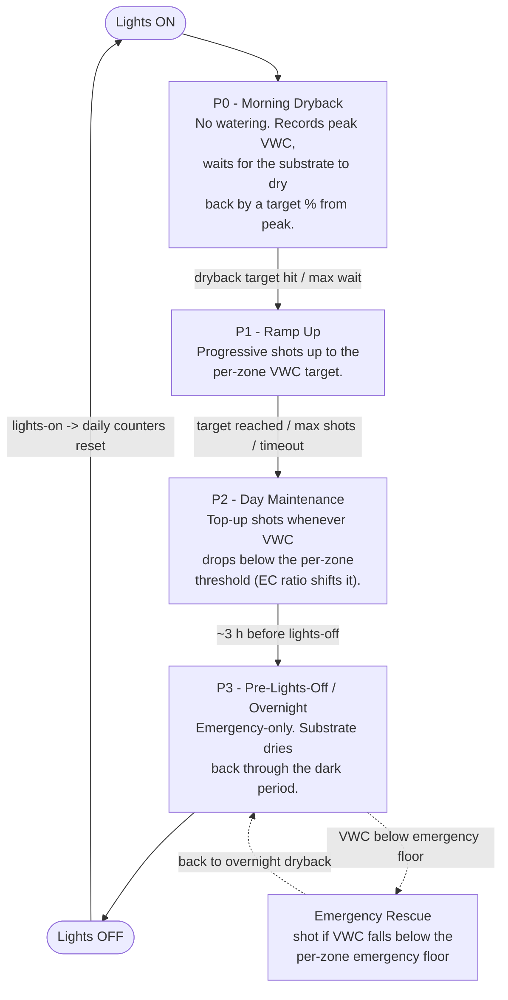
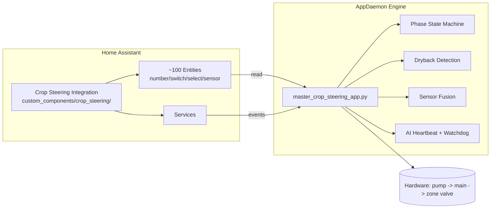
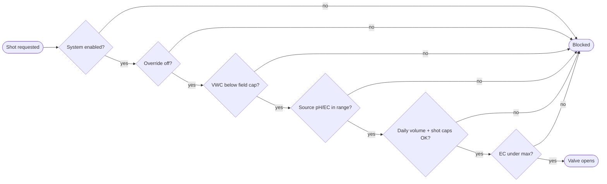

# Crop Steering for Home Assistant


Turn Home Assistant into an autonomous **crop-steering irrigation** controller. A
custom HA integration provides the entity surface + setup wizard; an AppDaemon app
runs the 4-phase logic and drives the irrigation hardware from real-time VWC/EC
sensors across 1–6 independent zones.

> **Irrigation only.** This controls *watering* — the P0→P1→P2→P3 cycle, shot sizing,
> EC steering, and safety. It does **not** control climate (temp / RH / CO₂).

---

## What it does

A daily 4-phase cycle, per zone, driven by sensor data and bounded by lights-on →
lights-on (one photoperiod = one "grow-day"):



**Vegetative mode:** higher VWC targets, lower EC, more frequent irrigation.
**Generative mode:** lower VWC targets, higher EC, controlled drought stress.
Per-zone `steering_mode` selects which.

---

## Architecture



Two layers:

- **Integration** (`custom_components/crop_steering/`) — creates all entities, runs
  the config-flow wizard, performs pure calculations (shot duration, EC ratio,
  adjusted thresholds), and fires service events. The data layer; never touches
  hardware.
- **AppDaemon engine** (`appdaemon/apps/crop_steering/`) — the brain. Reads sensor
  state and integration events, makes irrigation decisions, sequences hardware
  safely, and manages per-zone phase transitions. Modules: dryback detection,
  IQR-based sensor fusion, statistical prediction, adaptive crop profiles, a
  self-correcting `_ai_heartbeat`, and a hardware `_watchdog_check`.

**Data flow:** `Sensors → HA entities → AppDaemon decision engine → HA services → hardware switches`

See **`docs/SYSTEM_OVERVIEW.md`** for the full mental model.

---

## Safety

Every shot passes a chain of gates before a valve opens:



Plus: hardware sequencing prevents overlaps, valve close is read-back verified,
`_watchdog_check` kills a stuck valve/pump, drain-through detection backs off a
zone that takes water without VWC rising, emergency rescue is **exempt** from the
daily caps (a wilting zone is never denied water by a budget), and per-zone manual
overrides + phase pins are available for maintenance.

---

## What you need

**Hardware:** per-zone VWC + EC sensors (front/back pair ideal), a pump switch, a
mainline valve switch, and one valve switch per zone (1–6). Optional: source-water
pH/EC sensors for the irrigation-quality gate.

**Software:** Home Assistant 2024.3.0+, the AppDaemon 4 add-on, and HACS (recommended).

---

## Installation

> **Recommended:** install [Studio Code Server](https://github.com/hassio-addons/addon-vscode)
> and drive setup with [Claude Code](https://claude.ai/code). This system needs to
> be matched to your specific entity IDs and growing parameters — Claude Code can
> adapt mappings, tune thresholds, and walk you through it.

1. **Integration (HACS):** add this repo as a custom Integration repository, install
   "Crop Steering System", restart HA, then **Settings → Devices & Services → Add
   Integration → Crop Steering System**. Pick the zone count and map your hardware.
2. **HA packages:** copy `packages/irrigation/` into your HA `packages/` dir and add
   `homeassistant: { packages: !include_dir_named packages }` to `configuration.yaml`.
3. **AppDaemon:** copy `appdaemon/apps/crop_steering/` to your AppDaemon apps dir,
   copy `appdaemon/apps/apps.yaml` and edit the hardware entity IDs + sensor map to
   match your setup, copy `appdaemon.yaml` (set coordinates/timezone), restart
   AppDaemon. On supervised HA the config path is `/addon_configs/a0d7b954_appdaemon/`.
4. **Dashboard:** build a Lovelace dashboard from the `crop_steering_*` entities
   (see `dashboards/crop_steering.yaml` for a starting point). The **Activity** card
   reads `sensor.crop_steering_activity_log`.
5. **(Optional) flat-file config:** `crop_steering.env` lets you define zones in one
   file instead of the wizard — copy to `/config/crop_steering.env`, edit, then pick
   "Load from crop_steering.env" during setup. Annotated example: `crop_steering.env.example`;
   2/4/6-zone starters in `templates/`.

Full walkthrough: `docs/installation_guide.md`.

---

## Services

| Service | Inputs | What it does |
|---|---|---|
| `crop_steering.transition_phase` | `target_phase` (P0–P3) | Changes phase, fires `crop_steering_phase_transition` |
| `crop_steering.execute_irrigation_shot` | `zone`, `duration_seconds` | Fires `crop_steering_irrigation_shot` for hardware execution |
| `crop_steering.check_transition_conditions` | — | Evaluates state, fires an event with reasoning |
| `crop_steering.set_manual_override` | `zone` | Toggles per-zone manual control (optional timeout) |

The integration fires events; AppDaemon listens and acts.

---

## Entities

~100 entities under the `crop_steering` domain. Highlights:

- **Control:** `switch.crop_steering_system_enabled`, `switch.crop_steering_auto_irrigation_enabled`, `select.crop_steering_zone_X_steering_mode`, `input_select.crop_steering_zone_X_phase_control` (Auto / P0–P3).
- **Calculated sensors:** `sensor.crop_steering_ec_ratio`, `sensor.crop_steering_p2_vwc_threshold_adjusted`, per-phase shot-duration sensors, `sensor.crop_steering_activity_log`.
- **Per-zone:** VWC/EC, status, last irrigation, daily/weekly water + shot count, enable / manual-override / dripper-protection switches.
- **Tunables (per zone + global):** substrate volume, dripper flow, VWC targets, EC targets by phase, shot sizes, timing windows, daily caps — all in the HA UI.

Full reference: `ENTITIES.md`.

---

## AppDaemon modules

| Module | Purpose |
|---|---|
| `master_crop_steering_app.py` | The coordinator — decisions, phase logic, hardware sequencing, safety, activity feed |
| `phase_state_machine.py` | Per-zone P0→P1→P2→P3 transitions |
| `advanced_dryback_detection.py` | Peak/valley detection + dryback % |
| `intelligent_sensor_fusion.py` | IQR outlier filtering + multi-sensor averaging |
| `ml_irrigation_predictor.py` | Statistical trend analysis for timing |
| `intelligent_crop_profiles.py` | Per-crop/stage parameter profiles |
| `base_async_app.py` | Async base class shared by the modules |

---

## Repository structure

```
├── custom_components/crop_steering/   # HA integration (entities, services, calculations)
├── appdaemon/apps/crop_steering/      # AppDaemon engine + supporting modules
│   └── apps.yaml                      # AppDaemon app declaration + hardware/sensor map
├── packages/irrigation/               # HA package YAML (recorder, helpers)
├── dashboards/                        # Lovelace dashboard YAML
├── docs/                              # SYSTEM_OVERVIEW + install/operation/troubleshooting
├── templates/                         # Example .env configs (2 / 4 / 6 zone)
├── tests/                             # Unit tests (calculations)
├── config.yaml · appdaemon.yaml       # Example HA + AppDaemon config
└── crop_steering.env(.example)        # Flat-file zone configuration
```

---

## License

MIT

## Acknowledgments

Home Assistant Community, AppDaemon developers, and contributors advancing precision irrigation.
