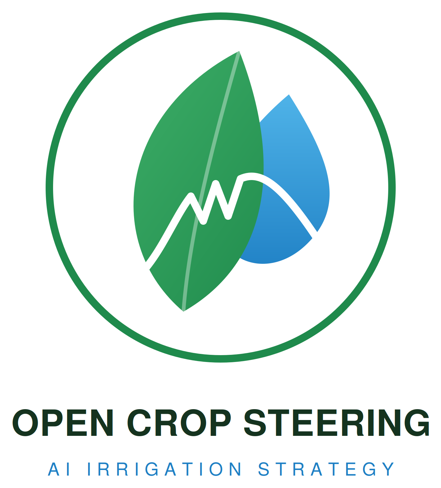
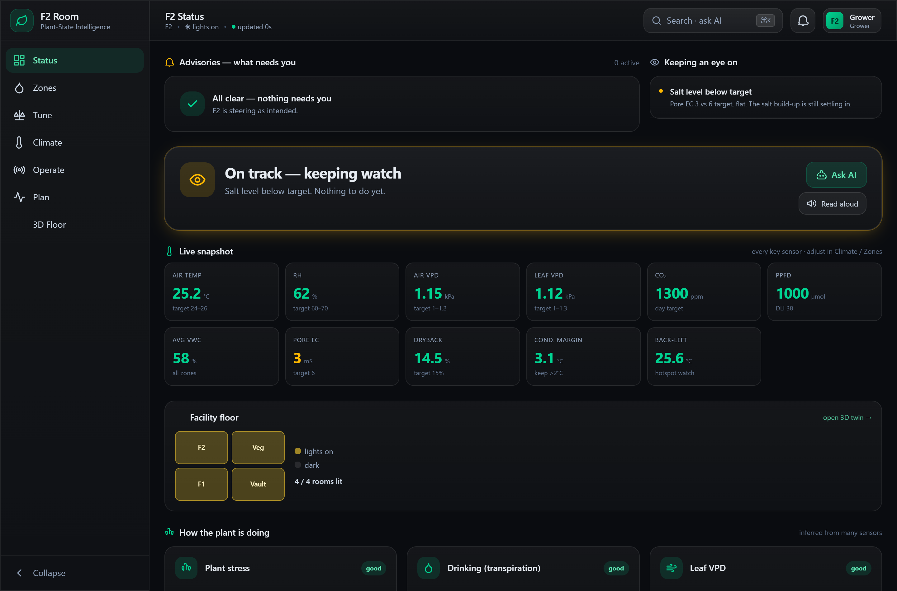
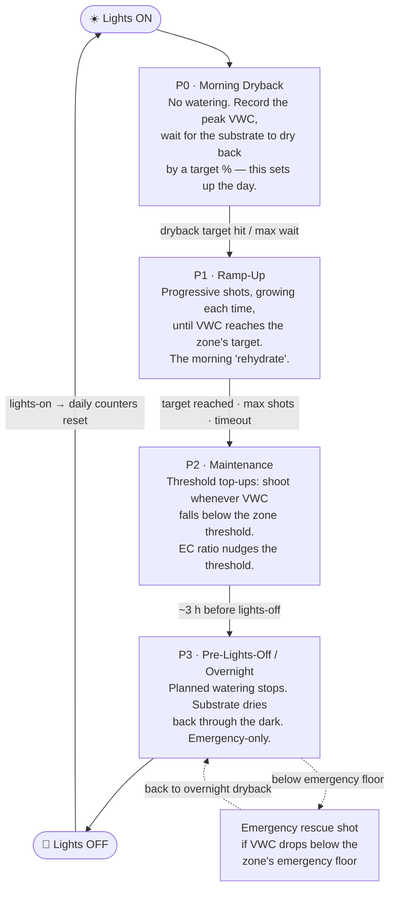
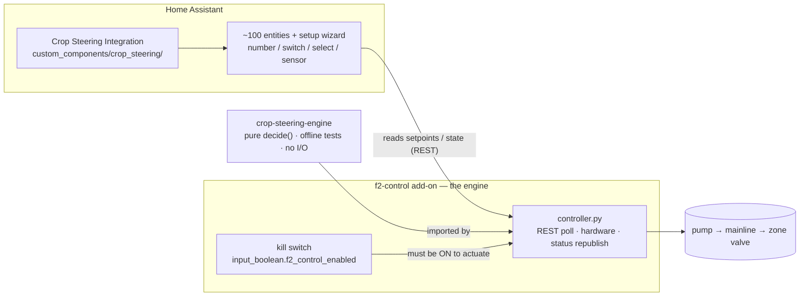
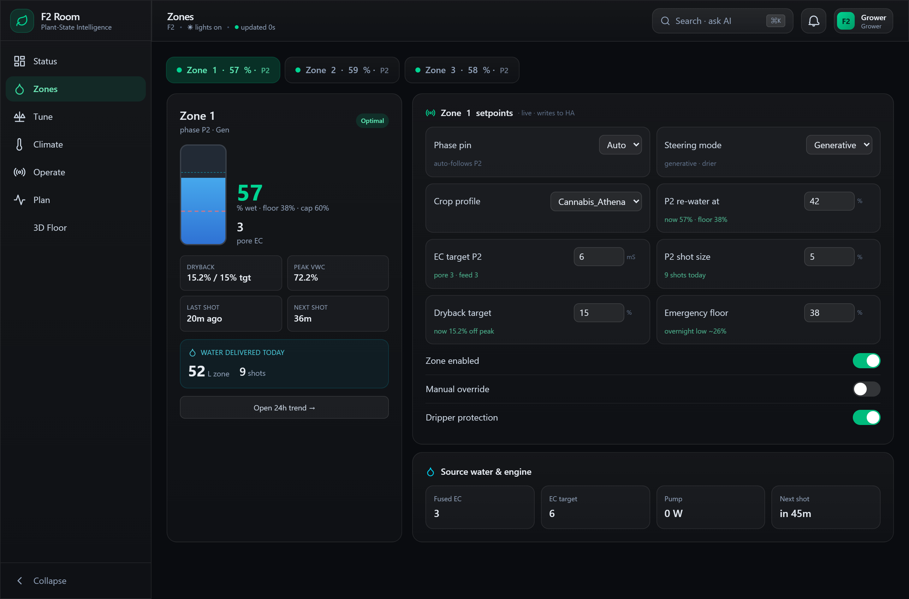
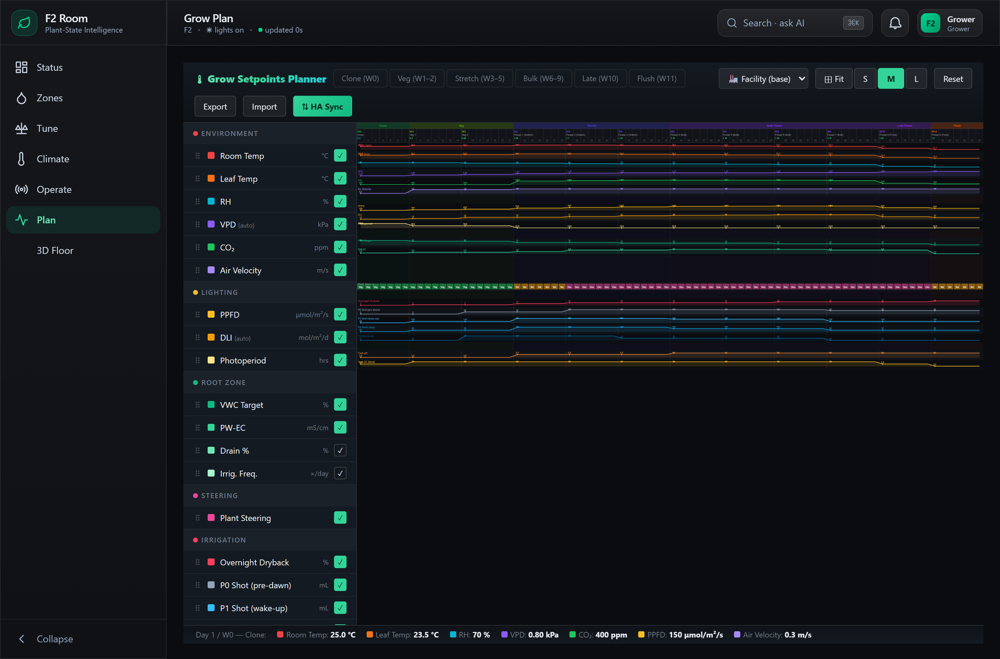
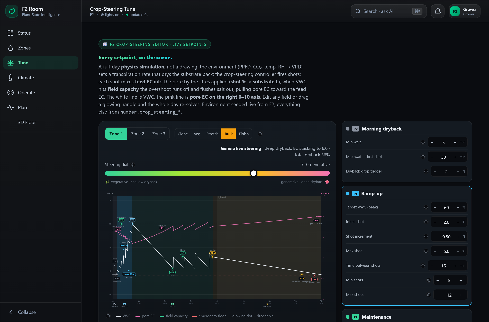
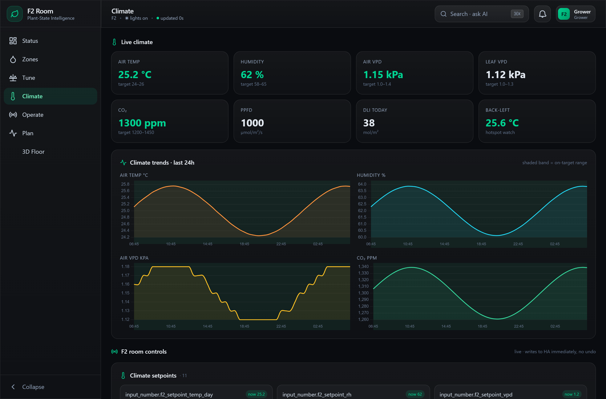
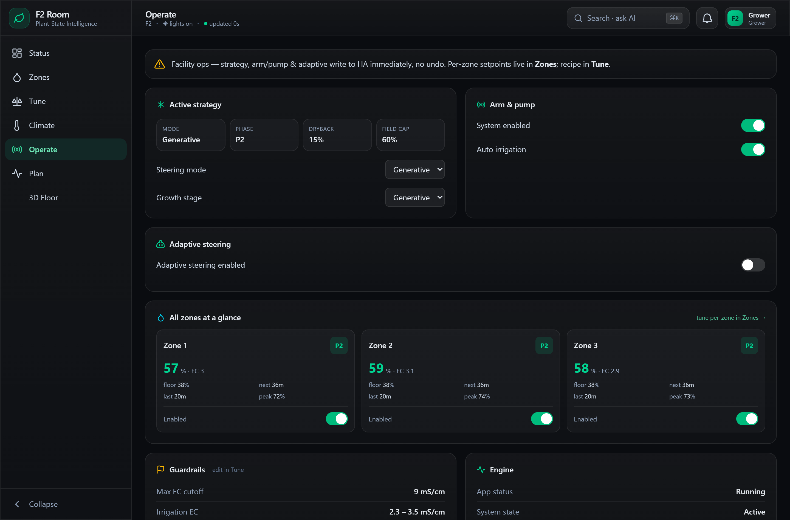

# Crop Steering for Home Assistant


<p align="center">
  
</p>



> **Professional crop steering — without the $3,000 controller and the monthly subscription.**
> If you already run Home Assistant and have moisture sensors in your substrate, you
> already own everything except the brain. This is the brain.

> **Related project — [open-crop-steering](https://github.com/JakeTheRabbit/open-crop-steering):**
> an optional AI-**supervisor** layer that sits *on top of* this integration. It authors recipes,
> proposes setpoints, and writes them to these `number.crop_steering_*` entities — with a
> tamper-evident audit trail for regulated facilities. It does **not** replace this repo: this
> **controller** still owns the P0–P3 phase logic, hardware sequencing, and safety gates. Run this
> on its own, or add that on top.

---

## The short version

This turns Home Assistant into an autonomous **crop-steering irrigation** controller.
It runs the full daily **P0 → P1 → P2 → P3** cycle — per zone, driven by live VWC/EC
sensor data — sequences your pump and valves safely, and steers each zone toward a
**vegetative** or **generative** growth response. It also **auto-stacks substrate EC**
to a per-stage target by closed-loop control of the P2 dryback — the generative salt
lever, run hands-off. Once it's mapped to your hardware and dialed in, it runs the room
on its own and you watch a dashboard.

It is **irrigation only**. It does not control climate.

---

## Why crop steering (and why automate it)

Plants don't just need water — they read it. The **moisture and EC curve** of the
substrate over a day is a language the plant responds to:

- A **big overnight dryback** + **higher feed EC** + a controlled morning wait tells
  the plant *"resources are scarce, finish up"* → a **generative** response: tighter
  internodes, more flower, more resin, denser fruit.
- **Consistent moisture** + **lower EC** + frequent small shots tells it *"conditions
  are easy, grow"* → a **vegetative** response: leafy, stretchy, fast structural
  growth.

**Crop steering is the practice of using irrigation itself to push the plant one way
or the other** — by deciding, every day, how far the substrate dries back, how fast
you bring it back up, what EC you feed, and when you stop so it can dry overnight.

That sounds simple until you try to do it by hand:

- The right first shot of the day depends on **how far the substrate actually dried
  back** overnight — which you can only know from a sensor, in real time.
- Shots have to **grow** through the morning ramp, then become **threshold top-ups**,
  then **stop** at the right moment before lights-off — all timed to the *substrate's*
  behaviour, not the clock.
- It has to happen on **every zone independently**, **every minute, all day**,
  forever, and it must **never** flood a room or feed bad water.

A timer can't do this — it waters the same amount whether the slab is bone-dry or
saturated. A human can't babysit it 24/7. Commercial controllers (AROYA, TrolMaster
and friends) *can* — for thousands of dollars and a closed, subscription ecosystem.

**This brings that decision engine to the hardware and the platform you already
own**, fully self-hosted and fully under your control.

---

## How it works

### The daily cycle

A "grow-day" is one **photoperiod** (lights-on → lights-on). Each zone walks four
phases on its own:



The **size and aggressiveness of that curve is how you steer.** A `steering_mode` of
**Vegetative** keeps VWC high and EC low; **Generative** allows deeper drybacks and
higher EC. You set it per zone.

> **One rule worth knowing:** every "dryback" number in the system is a *percentage-
> point drop from the peak* (how far it dries back **by**, never the value it dries
> back **to**), and the daily water/shot counters roll over at **lights-on** — the
> real start of a grow-day — not at midnight.

### The architecture

Three pieces, clean separation:



- **The integration** (`custom_components/crop_steering/`) is the data layer. A
  config-flow wizard creates ~100 entities — every setpoint, switch and diagnostic
  sensor — and exposes pure, unit-tested calculation helpers. It **never touches
  hardware.**
- **The f2-control add-on** (`addons/f2_control/`) is the brain — a single synchronous
  Python process that polls HA over REST, decides shots, sequences the hardware (with
  valve-close readback), republishes the `sensor.crop_steering_*` status surface, sends
  30-minute vitals to your phone, and is gated by a hard **kill switch**
  (`input_boolean.f2_control_enabled`, OFF = reads/computes but never actuates). It is
  the **only** thing that drives a valve.
- **The engine** (`crop-steering-engine/`) is a standalone, `pip`-installable package: the
  pure `decide()` core with no HA and no I/O, unit-tested offline, so the exact same
  logic runs inside the add-on or a test. The add-on vendors a copy for a self-contained
  build.

The feedback loop is the whole point: **sensors → entities → engine decision →
hardware → substrate changes → sensors.** Every poll can trigger a re-evaluation.

See `www/irrigation-manual.html` for the hardware-side operator manual and
[`CHANGELOG.md`](CHANGELOG.md) for release notes.

---

## Features, and what they're actually for

| Feature | Why it matters |
|---|---|
| **Per-zone autonomy** | Each zone (the `.env` auto-detects any number; tested to 24) runs its own phase machine, targets, and steering mode. Row 1 can be ramping in P1 while Row 3 dries back in P3. |
| **Sensor fusion** | Map as many VWC/EC probes per zone as you like; the **integration** fuses each zone to one value (average + outlier rejection — a downward guard for VWC) and publishes `sensor.crop_steering_vwc_zone_N` / `ec_zone_N`. The engine steers on that fused value, so one flaky probe can't fire — or block — a shot. |
| **Dryback detection** | Peak tracking + a dryback-rate slope on the VWC curve drives the P0 wait and the predictive P3 start — the engine acts on *real* substrate behaviour, not a guess. |
| **EC steering** | The current-EC ÷ target-EC ratio nudges the P2 threshold, so the system feeds and dries to hit your EC, not just your moisture. |
| **Source-water gate** | Irrigation is blocked while source pH/EC are out of range — it won't push bad water into your slabs. Fail-closed: a dead feed probe (past a grace window) holds rather than feeds blind. |
| **Lights-on watering watchdog** | A starvation backstop: if an enabled zone gets no water for `watchdog_hours` (default 3) during lights-on while VWC is below threshold, it forces a shot. Plus a **cross-zone under-drink flag** (a zone drinking < 40 % of the room median is surfaced) and a valve-stuck-open readback. *(`sensor.crop_steering_ai_heartbeat` is a liveness ping, not a self-tuning brain.)* |
| **Fail-closed hardware** | Every shot's valve close is read-back verified; a stuck-open valve cuts pump + mainline and alerts. A failed pump/mainline/valve call aborts the shot and is **not** counted. |
| **Bounded by design** | A per-zone daily **volume** cap stops runaway watering — but **emergency rescue is exempt**, so a genuinely dry plant is never denied water by a budget. A hard **max shot-duration** ceiling stops a config fat-finger flooding the room. |
| **Activity feed** | `sensor.crop_steering_activity_log` is a rolling, human-readable feed of every watered / blocked / phase event — the dashboard's black-box recorder. |
| **No-YAML setup** | A config-flow wizard (entity-picker dropdowns) or a single `.env` file maps your hardware and builds every entity — then **Configure → Edit zones & hardware** changes it later, no reinstall. |
| **Any number of probes per zone** | The UI wizard maps multiple VWC/EC sensors per zone; the integration fuses them (average + outlier reject) and the engine steers on the fused per-zone value. |
| **Multiple rooms** | Add the integration again per grow room — each is **fully isolated and autonomously steered**: its own zones, sensors, pump/mainline/valves, reservoir feed gate, photoperiod, setpoints and Repairs, namespaced `crop_steering_<room>_*`. The one add-on drives them all; a new room comes up behind its own **fail-safe-OFF kill switch** (`switch.crop_steering_<room>_engine_enabled`) until you arm it. *(Per-room **dashboard** scoping — `?room=` — is the remaining roadmap item.)* |
| **Dashboards in the sidebar** | The add-on serves the operator console + mobile page over HA **ingress** as a sidebar panel — no manual file copy, authenticated, with a Live/Demo toggle. |
| **Setup health checks** | Misconfiguration — missing kill switch, engine offline, a zone with no sensor, a fused sensor unavailable — surfaces as **fix-it cards in Settings → Repairs** that clear themselves when resolved. |
| **Configure once** | The add-on reads lights hours + zone count from the integration, so you set them once in the UI; no drift between the two. |
| **Named-stage recipes** | Pick **Veg / Transition / Bulk / Ripen** from a dropdown and it writes that stage's setpoints (VWC targets, dryback, EC targets, EC ceiling, shot size) into your zones in one move. Stored per room; applies to the existing entities (engine unchanged), every value clamped — no per-stage entity sprawl. |
| **Vmax advisory** | The engine watches each zone's morning wet-up and publishes the field-capacity ceiling it *actually* reaches (`sensor.crop_steering_zone_N_vmax_detected` + a confidence) so you can steer off the substrate's real ceiling. Advisory — nothing auto-tunes from it. |
| **Predictive overnight (P3)** | The engine starts a zone's overnight dryback (P3) early when its current dryback rate means it will land on the target dryback by lights-off — so a zone isn't stranded mid-cycle and doesn't need overnight emergency shots to recover. |
| **Feed-lockout diagnostic** | When a low-VWC zone isn't being fed, the dashboard names the exact gate stopping it — dosing / fill / flush, source-water gate, EC ceiling, daily-volume cap, manual override, zone disabled, kill switch — and attaches it to the under-watered alert. |
| **Manual pump modes** | The `nutrient_dosing_active` / `f2_fill_mode` / `f2_flush_mode` booleans hand the pump to the operator (hose-flood or tank dosing); the engine pauses **all** its own shots while any of them is on. |
| **Operator console** | One dependency-free dashboard, `www/f2.html` — tabs **Overview / Substrate / Zones / Steering / Analyze / Climate / Floorplan** — with click-to-fix advisories (an issue links you straight to the control that resolves it). [Try it live](#live-demo-no-install). |
| **Mobile control surface** | `www/overview.html` — a phone-first one-pager (**Steer / Controls / Dosing**): per-zone VWC + target / pore-EC + target / substrate temp, room climate (temp / VPD / CO₂ / PPFD / DLI), pump + light + zone controls, and the veg-room peristaltic dosing pumps feeding F2. |
| **Live shot sizing** | The f2-control add-on computes each shot's run-time from your *real* substrate volume + per-zone flow (plants × drippers × L/hr), so a `%`-of-substrate shot delivers exactly that — no hardcoded guess. Published as `sensor.crop_steering_p1/p2/p3_shot_duration_seconds`. |
| **Anti-short-cycle** | P2 EC-correction shots (flush/dilute/rescue) respect a minimum interval, so a no-runoff nibble can't stack EC and machine-gun the pump. |
| **PID EC loop** *(optional)* | A real Kp/Ki/Kd controller (integral anti-windup, clamped) on the pore-EC error as a drop-in upgrade to the stepped EC-steer. Off by default, behind one switch, gains tunable. |
| **Minimum daily water floor** *(optional)* | A guaranteed **mL-per-plant-per-day** baseline, front-loaded and **sensor-independent** — a lying or dead VWC probe can't quietly starve a plant. A hard anti-drown ceiling is the only thing that holds it; bad feed water still blocks it. Off until you set a number per zone. |
| **Max shot-duration cap** | A hard ceiling on any single shot's run-time (default 900 s) — a substrate/flow fat-finger can't turn one watering into a multi-hour flood. |

---

## Live demo (no install)

**▶ Try the full dashboard live — mock data, nothing to install:**
**https://jaketherabbit.github.io/HA-Irrigation-Strategy/f2.html?demo**

`f2.html` is the unified operator dashboard. Its **demo mode** runs on baked-in "perfect grow"
data — no Home Assistant, no token, no hardware, no network. Click through every tab: **Overview**
(advisories first + the full live-sensor snapshot + plant-state gauges + the facility-floor mini),
**Substrate** (the VWC/EC/dryback trend), **Zones** (per-zone cockpit — VWC/EC/dryback, water
delivered, co-located setpoints), **Steering** (the science-grounded visual setpoint editor + the
grow-week recipe/timeline as a subview), **Analyze** (limiting-factor + driver charts), **Climate**
(24 h history charts + every room control), and **Floorplan**. The live install adds the camera, the
full interactive 3D facility twin, and the Ask-AI co-pilot.

- **Hosted:** the link above (GitHub Pages — auto-enters demo mode).
- **Locally:** open `www/f2.html?demo` in any browser.

Drop `?demo` and load it from your Home Assistant (`/local/f2.html`, long-lived token stored only
in your browser) to drive the real thing.

**▶ See how it all connects — interactive 3D system map:**
**https://jaketherabbit.github.io/HA-Irrigation-Strategy/system-map.html** — a standalone three.js
diagram of the two layers, the entity contract between them, the pump→mainline→valve hardware
sequence, and the sensor feedback loop. No install, no data.

### All live pages

Everything in `www/` is published to GitHub Pages — **[index of all pages](https://jaketherabbit.github.io/HA-Irrigation-Strategy/)**:

| Page | What it is |
|---|---|
| [F2 dashboard (demo)](https://jaketherabbit.github.io/HA-Irrigation-Strategy/f2.html?demo) | The unified operator dashboard — the flagship |
| [Crop Steering console (demo)](https://jaketherabbit.github.io/HA-Irrigation-Strategy/crop_steering.html?demo) | The earlier control console |
| [Setpoint Tune editor (demo)](https://jaketherabbit.github.io/HA-Irrigation-Strategy/crop_steering_tune.html?demo) | Visual editor for the full setpoint table |
| [Grow Setpoints Planner](https://jaketherabbit.github.io/HA-Irrigation-Strategy/setpoints.html) | Week-by-week grow-plan timeline |
| [System Guide](https://jaketherabbit.github.io/HA-Irrigation-Strategy/SYSTEM_GUIDE.html) | The full written system guide |
| [3D System Map](https://jaketherabbit.github.io/HA-Irrigation-Strategy/system-map.html) | Interactive three.js architecture diagram |
| [Irrigation Manual](https://jaketherabbit.github.io/HA-Irrigation-Strategy/irrigation-manual.html) | Hardware-side manual — plumbing, valves, pumps |

### Screenshots (from the demo)

| Status | Zones | Plan (timeline) |
|---|---|---|
|  |  |  |
| **Tune editor** | **Climate** | **Operate** |
|  |  |  |

---

## The safety model

Every shot passes a chain of gates before a valve opens. Nothing gets to the pump
without clearing all of them:

```mermaid
flowchart LR
    REQ(["Shot requested"]) --> C0{Kill switch ON?}
    C0 -- no --> STOP(["🚫 Blocked\n(reason logged + on the dashboard)"])
    C0 -- yes --> C1{System + zone enabled,\noverride OFF?}
    C1 -- no --> STOP
    C1 -- yes --> C2{Not dosing / fill / flush?}
    C2 -- no --> STOP
    C2 -- yes --> C3{Source pH/EC in range?\n(fail-closed on dead probe)}
    C3 -- no --> STOP
    C3 -- yes --> C4{Daily volume cap OK?\n(emergency rescue exempt)}
    C4 -- no --> STOP
    C4 -- yes --> C5{Pore-EC under hard max?\n(or a dilutive flush)}
    C5 -- no --> STOP
    C5 -- yes --> FIRE(["✅ Pump prime → mainline → valve → irrigate → shutdown"])
```

The whole engine is gated by a hard **kill switch** (`input_boolean.f2_control_enabled`,
OFF = never actuates). The **source-water gate checks both pH and EC** (with a last-known-good
grace window, fail-closed if a feed probe dies). High pore-EC doesn't lock a zone out — if the feed
is dilutive the engine **flushes** rather than blocks. Service-call writes are **fail-closed** — a
failed pump/mainline/valve command aborts the shot and isn't counted — and P2 EC-correction shots
respect a **minimum interval** so a no-runoff nibble can't machine-gun the pump.

> *Field capacity isn't a hard pre-shot gate — it's the **ceiling the P1 ramp targets** and a
> precondition for EC flushes. A hard anti-drown ceiling (~90 % VWC) is what blocks a flood.*

Plus hardware sequencing that prevents overlapping shots, per-zone manual overrides, and an instant
emergency stop (safe-off of pump + mainline + all valves on shutdown).

---

## Prerequisites

**Software**
- **Home Assistant** 2024.3.0+ (HA OS / Supervised recommended — you need add-ons).
- **The f2-control add-on** (this repo's `addons/f2_control/` — the live engine; you install it in
  step 4). It runs in its own container — no extra runtime to install.
- **HACS** (recommended, for one-click integration install).

**Hardware — per zone**
- **Substrate VWC sensor(s)** — moisture %. A front/back pair per zone is ideal; one
  works. (TEROS 12, Acclima, SDI-12 probes, etc.)
- **Substrate EC sensor(s)** — pore-water EC, mS/cm. Same front/back logic.
- **A controllable valve** — one HA `switch.` per zone (relay board, ESPHome,
  KC868, smart relay — anything HA can toggle).

**Hardware — shared**
- **A pump** and a **mainline solenoid**, each an HA `switch.`.
- Drippers sized for your plant count (the engine converts shot *size %* → valve
  *seconds* using your dripper flow rate and substrate volume).

**Optional but recommended**
- **Source-water pH + EC sensors** (e.g. Atlas Scientific) to enable the
  irrigation-quality gate.

**The substrate itself** should be a steerable medium under dripper irrigation —
rockwool slabs/blocks or coco in pots. Crop steering is a substrate technique; it
doesn't apply to soil beds.

---

## Installation

**Crop Steering is two pieces, and you install both — in two different places.**

| | What it is | Installed via | Touches hardware? |
|---|---|---|---|
| **1. The integration** | The *data + setup* layer. A UI wizard creates ~100 `crop_steering_*` entities (every setpoint, sensor, switch) and lets you map your hardware with dropdowns. | **HACS** | **No — ever** |
| **2. The Crop Steering add-on** | The *engine*. Reads your sensors, decides shots, drives the pump/valves — and serves the **dashboards** as a sidebar panel. Gated by a hard kill switch. | **Add-on Store** | **Yes — the only thing that opens a valve** |

The integration is the brain's notepad; the add-on is the brain. **Install the integration first,
map your room, then the add-on.** Nothing moves a drop of water until the add-on is installed **and**
its kill switch is flipped on — so you can build and explore the whole thing safely first.

> ### 🤖 Installing with an AI agent
> This system has to be **matched to your exact entity IDs and substrate**, which is
> exactly the kind of adapt-and-verify work an agent is good at. If you run
> [Claude Code](https://claude.ai/code) (or similar) against your HA config — e.g. via
> [Studio Code Server](https://github.com/hassio-addons/addon-vscode) — point it at
> **[`docs/AGENT_INSTALL.md`](docs/AGENT_INSTALL.md)**: a precise, ordered runbook that
> discovers your hardware entities, writes the `.env`, installs both layers, maps the
> hardware, and verifies the engine is alive — with the actuation steps gated for your
> explicit go. The steps below are the same path, done by hand.

### 1 · Install the integration

Via HACS → Integrations → **Custom repositories** → add this repo as an *Integration*
→ install **"Crop Steering System"** → restart HA.

Then **Settings → Devices & Services → Add Integration → Crop Steering System**.

### 2 · Tell it about your room (UI wizard or `.env`)

Two paths:

- **UI wizard (no file needed).** Choose *Manual UI configuration*; pick a zone count (1–24+), then
  for each zone pick its **valve switch** and **moisture / EC sensors** — *as many probes per zone as
  you like; they're fused (averaged, outliers rejected)* — from dropdowns, followed by your pump,
  mainline, lights and substrate facts. Every field has a tooltip.
- **`crop_steering.env` file.** Copy a `templates/` starter (2 / 4 / 6-zone) to
  `/config/crop_steering.env`, fill in your entity mappings, then choose *"Load from
  crop_steering.env"* — zones auto-detected.

Either way the integration builds all ~100 `crop_steering_*` entities.

> **Forgot a sensor, or want to add/swap one later?** Integration → **Configure → Edit zones &
> hardware** — no reinstall. **Running more than one grow room?** Add the integration *again* and name
> the room; each room is **fully isolated** (its own zones, sensors, pump and setpoints), and your
> first room is unchanged. Setup problems show up as fix-it cards in **Settings → Repairs**.

### 3 · Add the HA package

Copy `packages/irrigation/` into your HA `packages/` directory and add to
`configuration.yaml`:

```yaml
homeassistant:
  packages: !include_dir_named packages
```

### 4 · Install the engine (f2-control add-on)

> 📖 **Prefer pictures?** A full click-by-click visual walkthrough (HA screenshots + numbered
> callouts, zero→armed):
> **[▶ View the install guide](https://jaketherabbit.github.io/HA-Irrigation-Strategy/install.html)**
> (rendered). Source / offline copy: [`docs/INSTALL_GUIDE.html`](docs/INSTALL_GUIDE.html) — download
> and open it in a browser (GitHub shows `.html` as source, not rendered).

**Easiest — one-click by URL.** In Home Assistant: **Settings → Add-ons → Add-on Store → ⋮
(top-right) → Repositories** → paste the **dedicated add-on repo**:

```
https://github.com/JakeTheRabbit/f2-control
```

→ **Add**, close the dialog, and **Crop Steering** appears in the store → open it → **Install**.

> Paste that into the **Add-on Store → Repositories** dialog — it's the dedicated add-on repo
> (`repository.yaml` + the add-on at its root, so HA can read it). Do **not** paste *this*
> monorepo's URL or a `.../addons/f2_control` subfolder — HA can't read those (that's the
> `remote: Not Found` error), which is exactly why the add-on repo above exists.

**Or — local copy (dev / offline):** copy `addons/f2_control/` onto the host at
`/addons/f2_control/`, then **Add-on Store → ⋮ → Reload** → *F2 Control* shows under **Local
add-ons** → Install. *(In the store it's named **Crop Steering**.)* (This monorepo's `addons/f2_control/` is the add-on's source; the
[`f2-control`](https://github.com/JakeTheRabbit/f2-control) repo is the published copy.)

Either way, then:
1. In the add-on's **Configuration** set the lights hours, your notify service, and (if you use a
   source-water gate) the feed **EC / pH sensor** entity IDs. The **pump / mainline / per-zone valve
   map** and the **per-zone substrate / plant / dripper / flow** facts are set in the *integration*
   setup wizard (step 2) and read live from its number entities — so a shot's `%`-of-substrate
   run-time is always correct without re-entering hardware here.
2. Create the kill switch `input_boolean.f2_control_enabled` (a Helper, or deploy
   `addons/f2_control/f2_control_package.yaml` to `/config/packages` + reload). **OFF = safe** — the
   add-on reads, computes and notifies but never opens a valve.
3. **Start** it — the log shows `starting | kill-switch … | token present: True`. Flip the kill switch
   **ON** to go live.

It's a single synchronous Python process: polls HA over REST (no asyncio event loop), drives the
hardware with valve-close readback + fail-closed writes, republishes the `sensor.crop_steering_*`
surface, and pings your phone every 30 min.

> **Updating the engine later — Rebuild, don't Restart.** The add-on bundles its Python into the
> container image when it's **built** (`Dockerfile COPY`). After you change anything under
> `addons/f2_control/`, use **Add-ons → Crop Steering → ⋮ → Rebuild** — a plain **Restart keeps the old
> code** (it only re-reads the Configuration options, not the Python). Rebuild re-copies the code and
> restarts. *(Shot length lives in the Python, but is also driven by the `substrate_l`/`flow_lps`
> Configuration options on the running build — handy if you ever need to correct sizing without a rebuild.)*

### 5 · The dashboard

**You don't have to copy anything — the add-on serves the dashboards for you.** With the Crop
Steering add-on installed, a **Crop Steering** entry appears in your HA **sidebar** (it runs over HA
**ingress** — authenticated, never exposed to your LAN). If you don't see it, toggle **Show in
sidebar** on the add-on's Info tab. Open it and you get a **Live / Demo** chooser:

- **Live** reads your real sensors using your existing HA login — nothing to paste, no URL to edit
  (works in the mobile app).
- **Demo** is baked-in mock data, so you can click around with nothing connected.

**It's one page with tabs along the top — click a tab to move between its parts:**

- **Overview** — advisories first (tap an issue → land on the control that fixes it), the full live
  snapshot, plant-state gauges, the facility-floor mini. (The old "Operate" pump/engine controls live
  here, under *Irrigation*.)
- **Substrate** — the VWC / EC / dryback trend over time.
- **Zones** — the per-zone cockpit: VWC / EC / dryback, water delivered, co-located setpoints.
- **Steering** — the visual setpoint editor (yield/potency models, limiting-factor solver, driver
  charts); the grow-week **recipe/timeline** planner is a subview here.
- **Analyze**, **Climate** (24 h history + room controls), and **Floorplan** (the 3D facility twin).

It reads live state + 24 h history from the HA REST API and parses `sensor.crop_steering_activity_log`
for the per-shot feed.

**Linking to a specific page.** Each page is its own file, so you can deep-link straight to it:
`…/overview.html` (mobile one-pager), `…/setpoints.html` (recipe planner), `…/system-map.html` (3D
map). Adding `?demo` to a dashboard page (`f2.html`, `overview.html`, `crop_steering.html`) runs it
standalone on mock data.

**Embedding it as a card** (inside an existing Lovelace dashboard): add a **Webpage** card (or an
`iframe` card in YAML) pointing at the dashboard URL and it shows as a card on any view:

```yaml
type: iframe
url: /local/f2.html      # or the add-on's ingress URL
aspect_ratio: 75%
```

Prefer **native HA cards**? [`crop_steering_lovelace.yaml`](crop_steering_lovelace.yaml) is a
pure-Lovelace alternative (markdown + Jinja compute the live verdict / exception list and cover every
`crop_steering` entity) — paste it into a new dashboard's raw-config editor (regenerate with
`scripts/build_lovelace.py`).

**Manual / offline copy.** You can still drop **[`www/f2.html`](www/f2.html)** into `/config/www/`
and open `/local/f2.html` (phone one-pager: **[`www/overview.html`](www/overview.html)** →
`/local/overview.html`) — both work standalone, dependency-free, with a long-lived token entered once.

---

## Implementation — actually dialing it in

This is the part most guides skip. **It will not be perfect the moment you turn it
on**, and that's normal — crop steering is tuned to *your* substrate's real
behaviour. Plan for this:

1. **Arm it cold, watching.** Keep `switch.crop_steering_system_enabled` ON but treat
   the first day as observation. The activity feed + per-zone phase sensors tell you
   exactly what it's deciding and why.
2. **Set the physical truths first.** Substrate volume, dripper flow rate, drippers
   per plant, plant count — these convert "5% shot" into real seconds of valve time.
   Get these right before tuning anything else, or every shot will be the wrong size.
3. **Tune targets to observed reality, not theory.** Watch where each zone's VWC
   *actually* peaks and troughs over a day, then set P1 target / P2 threshold /
   emergency floor inside that real band. A target the substrate can't reach makes a
   zone chase its tail; a floor it never hits never protects it.
4. **Steer in one variable at a time.** Pick vegetative or generative per zone, adjust
   the overnight dryback and feed EC, and give it a few days to respond before
   changing more.
5. **Trust the safety net, but check it.** The daily caps, source-water gate, drain
   detection and watchdog are there so a mistake can't flood a room — but verify the
   first real cycles fire and stop where you expect.

A row that takes water without its VWC rising is telling you something *physical*
(channelling, a dry-pocketed sensor, a blocked dripper) — the engine will flag and
back off, but that's a go-look-at-the-row signal, not a setpoint to tune.

---

## Daily operation

Once dialed in, the loop runs itself. Day to day you're watching, not driving:

- **Phase per zone** — are they marching P0→P1→P2→P3 on schedule?
- **VWC/EC trend** — peaks and drybacks where you steered them?
- **Activity feed** — shots landing, nothing stuck blocked.
- **Water used vs cap** — a zone pinned at its cap, or one watering far more than its
  neighbours, is the first sign of a physical problem.

Full routine: `docs/operation_guide.md`. Mental model: `docs/SYSTEM_OVERVIEW.md`.

---

## Under the hood

The live engine is two parts: a **thin IO shell** (`addons/f2_control/f2_control/controller.py` —
read sensors → build a snapshot → `decide()` → drive valves → republish status) wrapped around a
**pure decision core** (`crop-steering-engine/` — the phase logic + EC steering + safety, with no HA
and no I/O, unit-tested offline). The shell is the only part that touches Home Assistant or hardware.

| Part | Job |
|---|---|
| `addons/f2_control/f2_control/controller.py` | The IO shell — REST poll, snapshot build, hardware sequencing + valve readback, EC-offset/PID accumulation, alerts/vitals, state persistence (`/data/state.json`) |
| `crop-steering-engine/src/crop_steering_engine/core.py` | The pure `decide()` core — P0→P1→P2→P3 transitions, per-phase irrigation rules, anti-lockout high-EC flush, watchdog, daily-cap budget, `ec_adjust` / `ec_pid` / `validate_params` / `cross_zone_outliers` |
| `custom_components/crop_steering/` | The HA integration — ~100 entities, config-flow wizard, per-zone sensor fusion, pure calculation helpers; never touches hardware |

```
custom_components/crop_steering/   # HA integration — entities, config-flow wizard, sensor fusion, pure calculations
addons/f2_control/                 # the LIVE engine (the f2-control add-on) — deploy here, then Rebuild
crop-steering-engine/src/          # the pure decide() engine package the add-on imports (offline-tested)
packages/irrigation/               # HA package YAML (recorder, helpers)
www/                               # operator dashboards (f2.html, overview.html) + the 3D floorplan
docs/                              # SYSTEM_OVERVIEW + install / operation / troubleshooting
templates/                         # 2 / 4 / 6-zone .env starters
tests/ · crop-steering-engine/tests/   # unit tests (integration helpers + the pure engine)
```

---

## Services

| Service | Inputs | Does |
|---|---|---|
| `crop_steering.transition_phase` | `target_phase` (P0–P3) | Move a zone's phase |
| `crop_steering.execute_irrigation_shot` | `zone`, `duration_seconds` | Fire a shot through the safe hardware sequence |
| `crop_steering.check_transition_conditions` | — | Evaluate + log the current decision reasoning |
| `crop_steering.set_manual_override` | `zone` | Toggle per-zone manual control |
| `crop_steering.custom_shot` | `target_zone`, `volume_ml`, `intent` | Volumetric shot (rescue / EC-rebalance / test) with intent tagging |

---

## Docs

- **`docs/SYSTEM_OVERVIEW.md`** — the whole-stack mental model
- **`docs/AGENT_INSTALL.md`** — step-by-step runbook for an AI agent to install + set up
- **`docs/installation_guide.md`** — the long-form install walkthrough
- **`docs/operation_guide.md`** — daily operator routine
- **`docs/troubleshooting.md`** — when something's off
- **`ENTITIES.md`** — every entity, explained
- **`www/system-map.html`** — interactive 3D map of the architecture + data flow

---

## License

MIT — use it, fork it, run your room with it.

## Acknowledgments

Built on the shoulders of the Home Assistant community, and everyone pushing precision
irrigation out from behind closed, expensive controllers.
