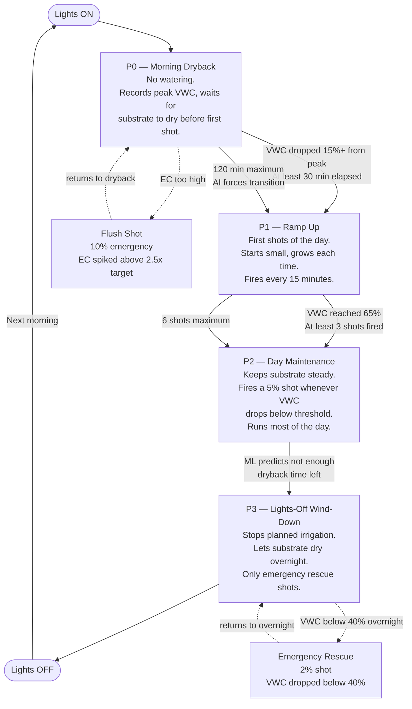
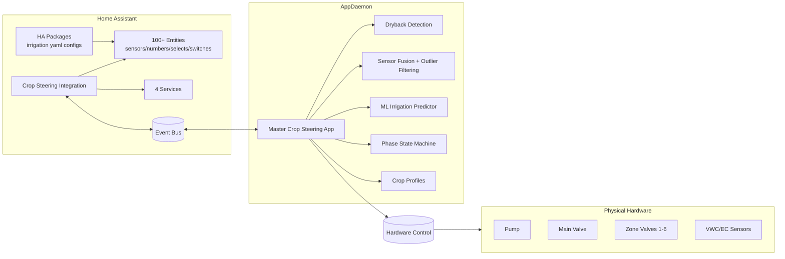
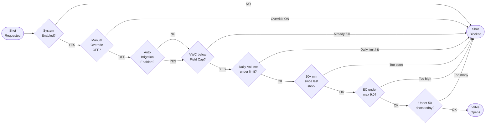

# Crop Steering for Home Assistant


Turn Home Assistant into a professional crop-steering controller. This system combines a custom HA integration (entities, services, calculations) with AppDaemon modules (automation logic, hardware control, phase state machine) to automate precision irrigation using VWC/EC sensors across 1-6 independent zones.

> **[Interactive System Guide](https://jaketherabbit.github.io/HA-Irrigation-Strategy/www/SYSTEM_GUIDE.html)** | **[Irrigation Manual](https://jaketherabbit.github.io/HA-Irrigation-Strategy/www/irrigation-manual.html)**
> Full visual documentation with flowcharts, configuration reference, and operational guides.

---

## What It Does

The system runs a daily 4-phase irrigation cycle driven by real-time sensor data. Each phase has distinct behavior, thresholds, and shot-sizing logic. The whole cycle is autonomous once configured — lights on triggers the sequence, lights off ends it.



**Vegetative mode:** higher VWC targets (65-70%), lower EC targets (1.5-2.0 mS/cm), more frequent irrigation.
**Generative mode:** lower VWC targets (55-60%), higher EC targets (2.5-3.5 mS/cm), controlled drought stress.

---

## Architecture



The system has three layers:

**Custom Integration** (`custom_components/crop_steering/`) creates all entities, registers services, performs calculations (shot duration, EC ratio, adjusted thresholds), and fires events. This is the data layer.

**AppDaemon** (`appdaemon/apps/crop_steering/`) is the brain. It listens to sensor updates and integration events, makes irrigation decisions, sequences hardware safely (pump → main valve → zone valve → irrigate → shutdown), and manages phase transitions. Modules include advanced dryback detection, IQR-based sensor fusion, statistical irrigation prediction, and adaptive crop profiles.

**HA Packages** (`packages/irrigation/`) provide entity definitions, template sensors, automations, and helpers that wire everything together in your HA config.

### Data Flow

```
Sensors → HA entities → AppDaemon decision engine → HA services → Hardware switches
```

Every VWC/EC sensor update triggers AppDaemon to re-evaluate conditions. If thresholds are crossed, it queues a shot, runs safety checks, and executes the hardware sequence.

---

## Safety

Every shot request passes through a chain of safety gates before a valve opens:



Additional protections: hardware sequencing prevents overlaps, abandonment logic flags unresponsive zones, emergency stop kills everything instantly, and per-zone manual overrides are available for maintenance.

---

## What You Need

**Required hardware:**
- VWC sensors (moisture %) — ideally front and back per zone
- EC sensors (nutrient concentration mS/cm) — ideally front and back per zone
- Pump switch, main line valve switch, zone valve switches (1-6 zones)

**Optional sensors:** temperature, humidity, VPD, CO2, tank level

**Software requirements:**
- Home Assistant 2024.3.0+
- AppDaemon 4 add-on (required for automation)
- HACS (recommended for installation)

---

## Installation

> **Recommended:** Install [Studio Code Server](https://github.com/hassio-addons/addon-vscode) in Home Assistant and use it with [Claude Code](https://claude.ai/claude-code). This system will require modification to match your specific hardware, sensor entity IDs, and growing parameters. Claude Code can adapt entity mappings, tune thresholds, debug issues, and walk you through the whole setup interactively.

### 1. Integration (via HACS)

1. HACS → Integrations → Custom Repositories → `https://github.com/JakeTheRabbit/HA-Irrigation-Strategy` (Integration)
2. Install "Crop Steering System", restart HA
3. Settings → Devices & Services → Add Integration → Crop Steering System
4. Select number of zones (1-6), map your hardware entities and sensors


### 2. HA Packages

1. Copy `packages/irrigation/` to your HA config `packages/` directory
2. Add to your `configuration.yaml`:
   ```yaml
   homeassistant:
     packages: !include_dir_named packages
   ```
3. Restart Home Assistant

The six package files handle: core entities (`00_core`), sensor-to-entity mapping (`10_mapping`), model calculations (`20_model`), irrigation logic (`30_irrigation`), environment monitoring (`40_environment`), and alerts/watchdogs (`50_alerts_watchdogs`).

### 3. AppDaemon

1. Install AppDaemon 4 add-on in HA
2. Copy `appdaemon/apps/crop_steering/` to your AppDaemon apps directory
3. Copy `appdaemon/apps/apps.yaml` — edit hardware entity IDs and sensor mappings to match your setup
4. Copy `appdaemon.yaml` to your AppDaemon config root — update coordinates and timezone
5. Restart AppDaemon

For supervised HA, the AppDaemon config path is `/addon_configs/a0d7b954_appdaemon/`.

### 4. Dashboards

Copy dashboard YAML files from `dashboards/` into your HA dashboard configuration. Included: irrigation overview, crop steering controls, CO2/environment monitoring.

### 5. Environment Config (Optional)

`crop_steering.env` provides a flat-file alternative for zone configuration. Copy it to `/config/crop_steering.env`, edit entity mappings, then select "Load from crop_steering.env file" during integration setup.

See `docs/installation_guide.md` for the full step-by-step walkthrough and the [Interactive System Guide](https://jaketherabbit.github.io/HA-Irrigation-Strategy/www/SYSTEM_GUIDE.html) for visual reference.

---


## Upgrade Gap Analysis & To-Do

For the AROYA-equivalent roadmap status, see **`docs/upgrade/GAP_ANALYSIS_2026-05.md`**. It includes a module-by-module gap breakdown, production-readiness risks, and a prioritized implementation backlog.

## Services

| Service | Required Inputs | What It Does |
|---|---|---|
| `crop_steering.transition_phase` | `target_phase` (P0/P1/P2/P3) | Changes phase, fires `crop_steering_phase_transition` event |
| `crop_steering.execute_irrigation_shot` | `zone`, `duration_seconds` | Fires `crop_steering_irrigation_shot` event for hardware execution |
| `crop_steering.check_transition_conditions` | — | Evaluates current state, fires event with reasoning |
| `crop_steering.set_manual_override` | `zone` | Toggles per-zone manual control with optional timeout |

These services are the communication bridge between the HA integration and AppDaemon. The integration fires events, AppDaemon listens and acts.

---

## Entities

The integration creates 100+ entities under the `crop_steering` domain. Key ones:

**Control:** `select.crop_steering_irrigation_phase` (P0-P3), `select.crop_steering_steering_mode` (Vegetative/Generative), `switch.crop_steering_system_enabled`, `switch.crop_steering_auto_irrigation_enabled`

**Calculated sensors:** `sensor.crop_steering_ec_ratio` (current ÷ target EC), `sensor.crop_steering_p2_vwc_threshold_adjusted` (auto-adjusts by EC ratio), shot duration sensors for each phase

**Per-zone:** VWC/EC averages, zone status (Optimal/Dry/Saturated/Disabled/Sensor Error), last irrigation time, daily/weekly water usage, irrigation count, manual override switches

**Tunable parameters:** substrate volume, dripper flow rate, drippers per plant, VWC targets, EC targets by phase, shot sizes, timing windows, per-zone multipliers — all configurable through the HA UI.

Full entity reference: `ENTITIES.md` and the [System Guide](https://jaketherabbit.github.io/HA-Irrigation-Strategy/www/SYSTEM_GUIDE.html).

---

## AppDaemon Modules

| Module | Purpose |
|---|---|
| `master_crop_steering_app.py` | Orchestrates everything — listens to HA, makes decisions, sequences hardware |
| `phase_state_machine.py` | Manages P0→P1→P2→P3 transitions with configurable rules per zone |
| `advanced_dryback_detection.py` | Multi-scale peak/valley detection, dryback % calculation and prediction |
| `intelligent_sensor_fusion.py` | IQR outlier filtering, multi-sensor averaging, confidence scoring |
| `ml_irrigation_predictor.py` | Statistical trend analysis with rolling training window for timing predictions |
| `intelligent_crop_profiles.py` | Per-crop/stage parameter profiles with adaptive adjustment |
| `base_async_app.py` | Async base class shared by all modules |

---

## Repository Structure

```
├── custom_components/crop_steering/   # HA integration (entities, services, calculations)
├── appdaemon/apps/crop_steering/      # AppDaemon automation modules
├── packages/irrigation/               # HA package YAML files (6 files)
├── dashboards/                        # Lovelace dashboard YAML configs
├── www/                               # System Guide + Irrigation Manual (HTML)
├── docs/                              # Installation, operation, troubleshooting guides
├── templates/                         # Example .env configs for 2/4/6 zone setups
├── config.yaml                        # Example HA configuration.yaml
├── appdaemon.yaml                     # Example AppDaemon config
├── crop_steering.env                  # Zone configuration file
└── crop_steering.env.example          # Annotated example with all parameters
```

---

## Screenshots


For interactive documentation with flowcharts and configuration reference, see the **[System Guide](https://jaketherabbit.github.io/HA-Irrigation-Strategy/www/SYSTEM_GUIDE.html)**.

---

## License

MIT

## Acknowledgments

Home Assistant Community, AppDaemon developers, and contributors advancing precision irrigation.
