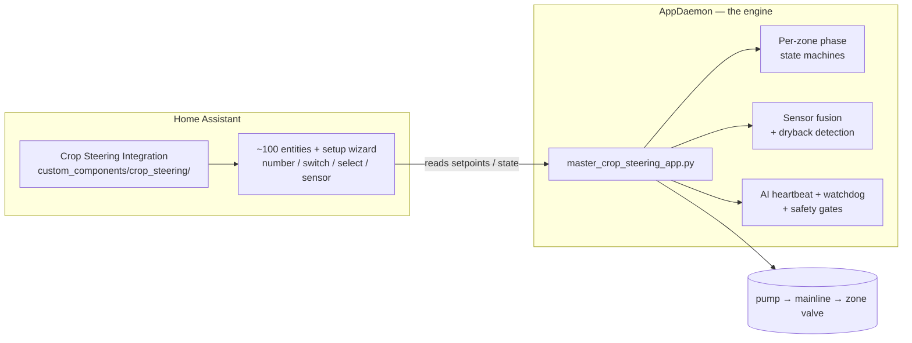
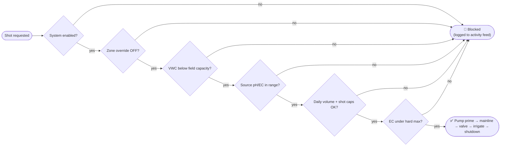

# Crop Steering for Home Assistant


> **Professional crop steering — without the $3,000 controller and the monthly subscription.**
> If you already run Home Assistant and have moisture sensors in your substrate, you
> already own everything except the brain. This is the brain.

---

## The short version

This turns Home Assistant into an autonomous **crop-steering irrigation** controller.
It runs the full daily **P0 → P1 → P2 → P3** cycle — per zone, driven by live VWC/EC
sensor data — sequences your pump and valves safely, and steers each zone toward a
**vegetative** or **generative** growth response. It also **auto-stacks substrate EC**
to a per-stage target by closed-loop control of the P2 dryback — the generative salt
lever, run hands-off. Once it's mapped to your hardware and dialed in, it runs the room
on its own and you watch a dashboard.

It is **irrigation only**. It does not control climate.

---

## Why crop steering (and why automate it)

Plants don't just need water — they read it. The **moisture and EC curve** of the
substrate over a day is a language the plant responds to:

- A **big overnight dryback** + **higher feed EC** + a controlled morning wait tells
  the plant *"resources are scarce, finish up"* → a **generative** response: tighter
  internodes, more flower, more resin, denser fruit.
- **Consistent moisture** + **lower EC** + frequent small shots tells it *"conditions
  are easy, grow"* → a **vegetative** response: leafy, stretchy, fast structural
  growth.

**Crop steering is the practice of using irrigation itself to push the plant one way
or the other** — by deciding, every day, how far the substrate dries back, how fast
you bring it back up, what EC you feed, and when you stop so it can dry overnight.

That sounds simple until you try to do it by hand:

- The right first shot of the day depends on **how far the substrate actually dried
  back** overnight — which you can only know from a sensor, in real time.
- Shots have to **grow** through the morning ramp, then become **threshold top-ups**,
  then **stop** at the right moment before lights-off — all timed to the *substrate's*
  behaviour, not the clock.
- It has to happen on **every zone independently**, **every minute, all day**,
  forever, and it must **never** flood a room or feed bad water.

A timer can't do this — it waters the same amount whether the slab is bone-dry or
saturated. A human can't babysit it 24/7. Commercial controllers (AROYA, TrolMaster
and friends) *can* — for thousands of dollars and a closed, subscription ecosystem.

**This brings that decision engine to the hardware and the platform you already
own**, fully self-hosted and fully under your control.

---

## How it works

### The daily cycle

A "grow-day" is one **photoperiod** (lights-on → lights-on). Each zone walks four
phases on its own:


The **size and aggressiveness of that curve is how you steer.** A `steering_mode` of
**Vegetative** keeps VWC high and EC low; **Generative** allows deeper drybacks and
higher EC. You set it per zone.

> **One rule worth knowing:** every "dryback" number in the system is a *percentage-
> point drop from the peak* (how far it dries back **by**, never the value it dries
> back **to**), and the daily water/shot counters roll over at **lights-on** — the
> real start of a grow-day — not at midnight.

### The architecture

Two layers, clean separation:



- **The integration** (`custom_components/crop_steering/`) is the data layer. A
  config-flow wizard creates ~100 entities — every setpoint, switch and diagnostic
  sensor — and exposes pure, unit-tested calculation helpers. It **never touches
  hardware.**
- **The AppDaemon engine** (`appdaemon/apps/crop_steering/`) is the brain. It reads
  those entities and your live sensors, decides shots, sequences hardware, and runs
  the phase logic. It is the **only** thing that drives a valve.

The feedback loop is the whole point: **sensors → entities → engine decision →
hardware → substrate changes → sensors.** Every VWC update can trigger a re-evaluation.

---

## Features, and what they're actually for

| Feature | Why it matters |
|---|---|
| **Per-zone autonomy** | Each zone (up to 6) runs its own phase machine, targets, and steering mode. Row 1 can be ramping in P1 while Row 3 dries back in P3. |
| **Sensor fusion** | Front/back sensor pairs per zone are averaged with IQR outlier rejection, so one flaky probe doesn't fire (or block) a shot. |
| **Dryback detection** | Peak/valley detection on the VWC curve drives the P0 wait and the overnight target — the engine acts on *real* substrate behaviour, not a guess. |
| **EC steering** | The current-EC ÷ target-EC ratio nudges the P2 threshold, so the system feeds and dries to hit your EC, not just your moisture. |
| **Source-water gate** | Irrigation is blocked while source pH/EC are out of range — it won't push bad water into your slabs. |
| **Self-healing (`_ai_heartbeat`)** | A periodic watchdog force-advances a phase that's stuck >4 h, flags stale sensors, and flags a zone that takes water without VWC rising (a draining/channelling row or a blocked dripper). |
| **Hardware watchdog** | Catches a valve or pump stuck on and emergency-stops; every shot's valve close is read-back verified. |
| **Bounded by design** | Per-zone daily **volume** and **shot-count** caps stop runaway watering — but **emergency rescue is exempt**, so a genuinely dry plant is never denied water by a budget. |
| **Activity feed** | `sensor.crop_steering_activity_log` is a rolling, human-readable feed of every watered / blocked / phase event — the dashboard's black-box recorder. |
| **No-YAML setup** | A config-flow wizard (or a single `.env` file) maps your hardware and builds every entity. |
| **Adaptive steering** *(optional)* | Detects each zone's true P1 moisture ceiling (`Vmax`), then derives the P2 trigger as `Vmax × (1 − dryback%)` per zone and ramps the P1 target up over days — each zone dries back the right % from *its own* measured ceiling. Off by default, behind one switch. |
| **Predictive overnight (P3)** | Each zone's *own* overnight dryback rate feeds the P3-start timing (was a shared room rate), with a buffer-safe cap so a zone lands on its target dryback by lights-on **without firing overnight emergency shots**. |
| **Feed-lockout diagnostic** | When a low-VWC zone isn't being fed, it names the exact gate stopping it — tank empty, dosing, flush/fill, source-water gate, EC ceiling, safety lockout, phase pin, disabled, daily cap — and attaches it to the under-watered alert. |
| **Manual pump modes** | `flush` / `fill` booleans hand the pump to the operator (hose-flood or tank dosing); the engine pauses its own shots and exempts the hardware watchdog while either is on. |
| **Operator console** | One dependency-free responsive dashboard (`www/crop_steering.html`): a one-glance verdict + system-health checks, word-threshold zone status, an issues drawer with real timestamps, expandable graphs, per-field coaching tooltips, and clickable pump/valve toggles. |

---

## Adaptive steering (optional, self-tuning)

The base engine runs every setpoint you give it. The **adaptive layer**
(`appdaemon/apps/crop_steering/adaptive_steering.py`) makes the key ones tune themselves to
each zone's measured behaviour. It is **off by default** and gated by a single switch —
`input_boolean.f2_adaptive_steering_enabled` — so it changes nothing until you arm it, and
every write is clamped and confidence-gated.

**1 · Per-zone P1 ceiling (`Vmax`) detection.** During the morning ramp it watches the wet-up
and decides when a zone has actually hit its field-capacity ceiling by *voting* four independent
signals — marginal-uptake collapse (ΔVWC per shot fading), peak plateau, pore-EC runoff, and a
saturating-curve fit — and locks a per-zone `Vmax` with a confidence score
(`sensor.crop_steering_zone_X_vmax_detected`).

**2 · Dryback-derived P2.** Once `Vmax` is known the P2 trigger is set to
`Vmax × (1 − dryback_target%)` **per zone, per mode** — so each zone dries back the *right %* from
its *own* measured ceiling. The EC-stacker still trims around that base.

**3 · Multi-day P1 ramp.** The P1 target climbs a configurable amount each day toward the detected
`Vmax` (capped below field capacity), so the morning saturation target follows the plant up as the
root mass fills the block — instead of a static number you hand-crank.

**4 · Predictive overnight cutoff (P3).** Each zone's *own* overnight dryback rate is measured and
fed into the engine's P3-start timing (previously a single shared rate), and the overnight target
dryback is capped so the predicted lights-on VWC stays above the P3 emergency floor + a buffer —
it lands on the dryback target **without needing an overnight emergency shot**. The forecast is
published as `sensor.crop_steering_zone_X_p3_prediction`.

Control + tuning live in `packages/f2_adaptive_steering.yaml` (the enable switch + confidence /
climb-rate / margin numbers). The module is a drop-in: it wires into the engine with four small
hooks in `master_crop_steering_app.py` (an `import`; a `tick()` call at the end of
`_update_zone_vwc_capacity`; one block in `_get_zone_dryback_rate` for the per-zone rate; and a
buffer-safe cap in `_should_zone_start_p3`) — documented in the module header.

---

## The safety model

Every shot passes a chain of gates before a valve opens. Nothing gets to the pump
without clearing all of them:



Plus hardware sequencing that prevents overlapping shots, drain-through back-off,
per-zone manual overrides and phase pins for maintenance, and an instant emergency
stop.

---

## Prerequisites

**Software**
- **Home Assistant** 2024.3.0+ (HA OS / Supervised recommended — you need add-ons).
- **AppDaemon 4** add-on (this is where the engine runs — required).
- **HACS** (recommended, for one-click integration install).

**Hardware — per zone**
- **Substrate VWC sensor(s)** — moisture %. A front/back pair per zone is ideal; one
  works. (TEROS 12, Acclima, SDI-12 probes, etc.)
- **Substrate EC sensor(s)** — pore-water EC, mS/cm. Same front/back logic.
- **A controllable valve** — one HA `switch.` per zone (relay board, ESPHome,
  KC868, smart relay — anything HA can toggle).

**Hardware — shared**
- **A pump** and a **mainline solenoid**, each an HA `switch.`.
- Drippers sized for your plant count (the engine converts shot *size %* → valve
  *seconds* using your dripper flow rate and substrate volume).

**Optional but recommended**
- **Source-water pH + EC sensors** (e.g. Atlas Scientific) to enable the
  irrigation-quality gate.

**The substrate itself** should be a steerable medium under dripper irrigation —
rockwool slabs/blocks or coco in pots. Crop steering is a substrate technique; it
doesn't apply to soil beds.

---

## Installation

> **Strongly recommended:** install [Studio Code Server](https://github.com/hassio-addons/addon-vscode)
> and drive the setup with [Claude Code](https://claude.ai/code). This system has to
> be **matched to your exact entity IDs and substrate** — Claude Code can adapt the
> mappings, tune thresholds against your real sensor data, and walk you through arming
> it safely. The steps below are the manual path.

### 1 · Install the integration

Via HACS → Integrations → **Custom repositories** → add this repo as an *Integration*
→ install **"Crop Steering System"** → restart HA.

Then **Settings → Devices & Services → Add Integration → Crop Steering System**.

### 2 · Tell it about your room (wizard or `.env`)

The wizard offers two paths:

- **`crop_steering.env` file (recommended).** Copy `crop_steering.env.example` to
  `/config/crop_steering.env`, fill in your zone count and entity mappings (there are
  annotated 2 / 4 / 6-zone starters in `templates/`), then choose *"Load from
  crop_steering.env"*. Zones are auto-detected.
- **Manual.** Pick a zone count (1–6) and map the pump, mainline, per-zone valves and
  sensors in the UI.

Either way, the integration builds all ~100 `crop_steering_*` entities.

### 3 · Add the HA package

Copy `packages/irrigation/` into your HA `packages/` directory and add to
`configuration.yaml`:

```yaml
homeassistant:
  packages: !include_dir_named packages
```

### 4 · Install the engine (AppDaemon)

1. Install the **AppDaemon 4** add-on.
2. Copy `appdaemon/apps/crop_steering/` into your AppDaemon `apps/` directory.
3. Copy `appdaemon/apps/apps.yaml` and **edit the hardware block** — the pump,
   mainline, per-zone valve switches, and the VWC/EC sensor entity IDs for *your*
   room. This file is where the engine learns your physical layout.
4. Copy `appdaemon.yaml` to the AppDaemon config root and set your latitude/longitude
   and timezone.
5. Restart AppDaemon. On supervised HA the config path is
   `/addon_configs/a0d7b954_appdaemon/`.

Watch the AppDaemon log for `Master Crop Steering Application … initialized!` — that's
the engine alive.

### 5 · Build the dashboard

Three ready-made dashboards ship in this repo — all built around **decision control**
(*is the room applying the intended stress, at the right time, in the right zones, with
trustworthy data, within safe limits?*) instead of a wall of sensors:

| Dashboard | File | What it is |
|---|---|---|
| **Standalone — desktop** | [`www/crop_steering_dashboard.html`](www/crop_steering_dashboard.html) | Full decision UI: a triage exception centre, time-aligned steering trace with client-computed dryback, per-zone band gauges + raw probes, a guarded control surface, and a data-trust layer. Open `http://<ha>:8123/local/crop_steering_dashboard.html`. |
| **Standalone — mobile** | [`www/crop_steering_mobile.html`](www/crop_steering_mobile.html) | The same five views, phone-first with a bottom tab bar. Add to home screen. |
| **Native Lovelace** | [`crop_steering_lovelace.yaml`](crop_steering_lovelace.yaml) | A native HA dashboard where markdown + Jinja compute the live verdict / exception list / trust — and it covers **every** `crop_steering` entity. Paste into a new dashboard's raw-config editor. |

The standalone pages need only a long-lived token (entered once, kept in your browser);
they read live state + 24 h history from the HA REST API, and parse
`sensor.crop_steering_activity_log` for the per-shot feed. Regenerate the Lovelace YAML
with `scripts/build_lovelace.py`.

|  |  |
|---|---|
|  |  |
|  |  |

---

## Implementation — actually dialing it in

This is the part most guides skip. **It will not be perfect the moment you turn it
on**, and that's normal — crop steering is tuned to *your* substrate's real
behaviour. Plan for this:

1. **Arm it cold, watching.** Keep `switch.crop_steering_system_enabled` ON but treat
   the first day as observation. The activity feed + per-zone phase sensors tell you
   exactly what it's deciding and why.
2. **Set the physical truths first.** Substrate volume, dripper flow rate, drippers
   per plant, plant count — these convert "5% shot" into real seconds of valve time.
   Get these right before tuning anything else, or every shot will be the wrong size.
3. **Tune targets to observed reality, not theory.** Watch where each zone's VWC
   *actually* peaks and troughs over a day, then set P1 target / P2 threshold /
   emergency floor inside that real band. A target the substrate can't reach makes a
   zone chase its tail; a floor it never hits never protects it.
4. **Steer in one variable at a time.** Pick vegetative or generative per zone, adjust
   the overnight dryback and feed EC, and give it a few days to respond before
   changing more.
5. **Trust the safety net, but check it.** The daily caps, source-water gate, drain
   detection and watchdog are there so a mistake can't flood a room — but verify the
   first real cycles fire and stop where you expect.

A row that takes water without its VWC rising is telling you something *physical*
(channelling, a dry-pocketed sensor, a blocked dripper) — the engine will flag and
back off, but that's a go-look-at-the-row signal, not a setpoint to tune.

---

## Daily operation

Once dialed in, the loop runs itself. Day to day you're watching, not driving:

- **Phase per zone** — are they marching P0→P1→P2→P3 on schedule?
- **VWC/EC trend** — peaks and drybacks where you steered them?
- **Activity feed** — shots landing, nothing stuck blocked.
- **Water used vs cap** — a zone pinned at its cap, or one watering far more than its
  neighbours, is the first sign of a physical problem.

Full routine: `docs/operation_guide.md`. Mental model: `docs/SYSTEM_OVERVIEW.md`.

---

## Under the hood

| Module | Job |
|---|---|
| `master_crop_steering_app.py` | The coordinator — decisions, phase logic, hardware sequencing, safety, activity feed |
| `phase_state_machine.py` | Per-zone P0→P1→P2→P3 transitions |
| `advanced_dryback_detection.py` | Peak/valley detection + dryback % |
| `intelligent_sensor_fusion.py` | IQR outlier filtering + multi-sensor averaging |
| `ml_irrigation_predictor.py` | Statistical trend analysis for shot timing |
| `intelligent_crop_profiles.py` | Per-crop / per-stage parameter profiles |
| `base_async_app.py` | Async base class shared by the modules |

```
custom_components/crop_steering/   # HA integration — entities, wizard, calculations
appdaemon/apps/crop_steering/      # the engine + supporting modules
  └── apps.yaml                    # YOUR hardware + sensor map lives here
packages/irrigation/               # HA package YAML (recorder, helpers)
dashboards/                        # Lovelace starting points
docs/                              # SYSTEM_OVERVIEW + install / operation / troubleshooting
templates/                         # 2 / 4 / 6-zone .env starters
tests/                             # unit tests (calculation helpers)
```

---

## Services

| Service | Inputs | Does |
|---|---|---|
| `crop_steering.transition_phase` | `target_phase` (P0–P3) | Move a zone's phase |
| `crop_steering.execute_irrigation_shot` | `zone`, `duration_seconds` | Fire a shot through the safe hardware sequence |
| `crop_steering.check_transition_conditions` | — | Evaluate + log the current decision reasoning |
| `crop_steering.set_manual_override` | `zone` | Toggle per-zone manual control |

---

## Docs

- **`docs/SYSTEM_OVERVIEW.md`** — the whole-stack mental model
- **`docs/installation_guide.md`** — the long-form install walkthrough
- **`docs/operation_guide.md`** — daily operator routine
- **`docs/troubleshooting.md`** — when something's off
- **`ENTITIES.md`** — every entity, explained

---

## License

MIT — use it, fork it, run your room with it.

## Acknowledgments

Built on the shoulders of the Home Assistant and AppDaemon communities, and everyone
pushing precision irrigation out from behind closed, expensive controllers.
