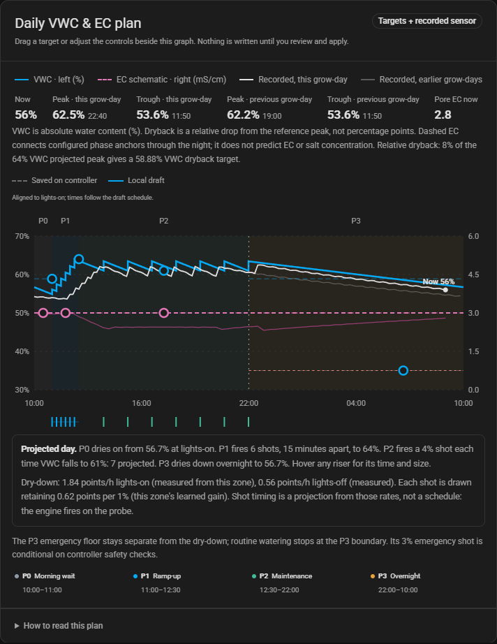
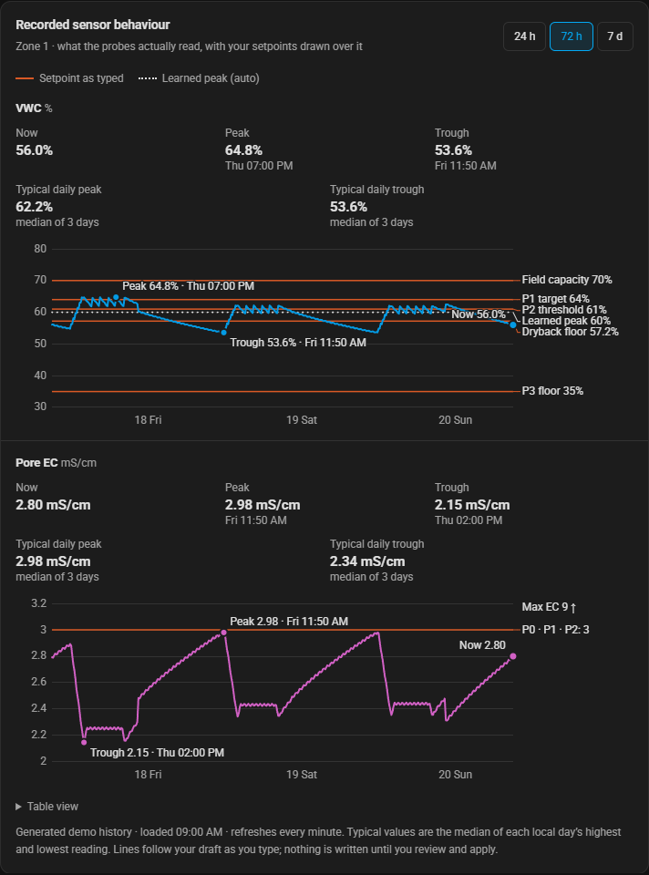
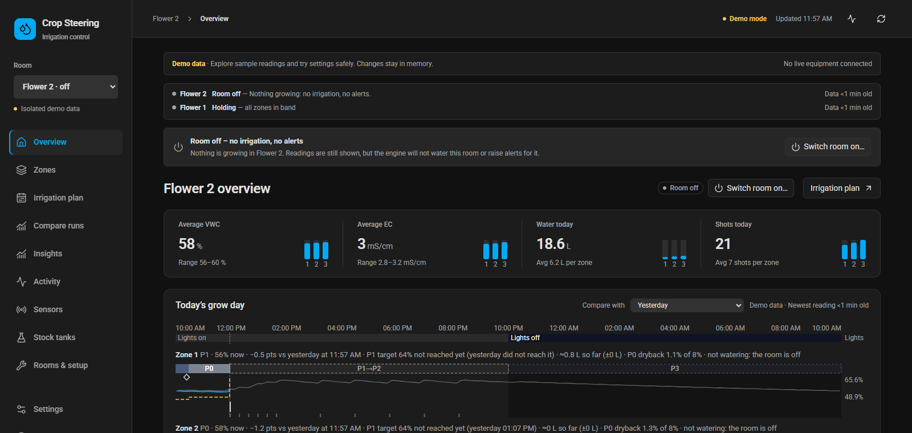

# Crop Steering for Home Assistant

A Home Assistant irrigation controller with a native operator workspace: see the room, plan each zone, map sensors, and review changes before applying them.

**[Open interactive demo](https://jaketherabbit.github.io/HA-Irrigation-Strategy/dashboard.html?demo=1)** · [Install](docs/INSTALL.md) · [Feature checklist](docs/FEATURE_MATRIX.md)

The demo opens directly in your browser with sample rooms, sensor data and editable plans. No login or Home Assistant installation is required; demo changes stay in your browser.

The demo includes clearly labelled synthetic recipes and current/previous runs for exploring comparisons. They demonstrate the software; they are not production recommendations.

> Read the [validated feature matrix](docs/FEATURE_MATRIX.md) for tested behavior and installation/commissioning limits. Install matching integration and controller versions; a demo is not proof of physical water delivery.

> **New in 2.18 / controller 0.15.1:** a setup wizard that keeps what you typed and says exactly what to fix, rooms with a single switch per zone, probes in µS/cm or m³/m³ converted instead of rejected, and setup helpers (unit pickers, substrate presets, catch test, learned-peak suggestion). **2.17** added the recorded-sensor plan graph with the projected P0-P3 day, room on/off, the full P1 ramp, Auto Setpoints, restart-safe setup and a patient pump read-back. Install the matching pair; see the [changelog](CHANGELOG.md).

## Start here

1. [Add the integration repository to HACS](https://my.home-assistant.io/redirect/hacs_repository/?owner=JakeTheRabbit&repository=HA-Irrigation-Strategy&category=integration), download it, and restart Home Assistant.
2. [Add Crop Steering in Devices & services](https://my.home-assistant.io/redirect/config_flow_start/?domain=crop_steering). Choose manual setup and name the first room.
3. [Add the controller app repository](https://my.home-assistant.io/redirect/supervisor_addon_repository/?repository_url=https%3A%2F%2Fgithub.com%2FJakeTheRabbit%2FHA-Irrigation-Strategy), then install and start **Crop Steering Controller**.
4. Open **Crop Steering** in the sidebar. Use **Rooms & setup** to map equipment and probes, then **Sensors** to verify readings. Keep the engine off until the installation checks pass.

Home Assistant owns the install/restart confirmations; these links take you directly to the relevant screens. They do not bypass HACS, Supervisor or hardware commissioning. [Complete installation and upgrade guide →](docs/INSTALL.md)

## See the room at a glance

Overview shows the controller state, mapped valve on/off report and last recorded irrigation for every zone. The graphical tank panel shows fill percentage, pump status, filling status, last recorded fill, EC, pH and temperature.

Map tank sensors in **Rooms & setup**. Display-only tank quality mappings are separate from feed-water safety gates. Last fill uses a recorded fill timestamp (timestamp sensor or a date-and-time helper), never a sensor update time. Unmapped or unavailable readings are labelled explicitly.

The recorded 8 September **2.16.0** live check showed F2 tank **42%**, **3.06 mS/cm EC**, **pH 5.66** and **17.9 °C**, plus an explicit recorded-fill source and timezone-aware last-irrigation times. Reviewed MCP tank-mapping proposals applied and read back in both rooms at setup revision **1**; healthy controller reports acknowledged revision **1**. The native HA sidebar was hidden in the panel, and the Home Assistant button reopened it. These are dated observations, not current readings or proof of physical delivery.

## One irrigation plan: Today and Schedule

**Irrigation plan** brings current targets and dated planning together. **Today** shows editable current targets when no schedule owns the room; an active schedule shows its effective targets and graph as read-only, with fallback manual inputs hidden. **Schedule** edits the dated plan for each zone.

The unified navigation and overnight curves are published and verified live in **2.16.1 / controller 0.13.3**. Both Today and Schedule opened in the native HA panel, all 398 existing control values matched the pre-upgrade snapshot, and the installed dashboard files matched the public demo. See the [release verification](docs/audits/2026-09-08-unified-plan.md). Existing `#/strategy` and `#/grow-plan` bookmarks continue to open Today and Schedule respectively.

In **Irrigation plan → Schedule**, choose a room, zone and day or week. The steering slider updates the VWC/EC planning curve and shows the targets behind it.

Save your own plans in **Irrigation plan → Schedule → Recipe library** and reuse them as local drafts. The library is kept in this browser, separated by room and demo/live mode. Loading retains the current zone start dates; saving and arming still use the normal review workflow. [Recipe library and reference sources →](docs/RECIPE_LIBRARY.md)

## Set targets against what the zone actually does

The graph you drag targets on in **Irrigation plan → Today** draws that zone's own probe underneath them: recorded VWC for this grow-day and the previous one, recorded pore EC, and the current reading with today's peak and trough. The VWC axis scales to the readings, so a zone sitting at 31% against a 40% target is obvious instead of a flat line on a 0–100% scale.

The day is drawn the way the controller runs it. P0 keeps drying after lights-on. P1 climbs one step per shot, every shot shown. P2 fires a shot each time VWC falls to its threshold. P3 dries down overnight to the next lights-on. Shot timing comes from the zone's own measured dry-down rate, so it is a projection, not a schedule: the engine always fires on the probe. Hover any riser for its time and size. If the targets cannot be reached at that zone's dry-down, the graph shows it: a P2 threshold far under the P1 target projects few or no maintenance shots.

Below it, a history panel shows 24 hours, 72 hours or 7 days of the same probes with each setpoint drawn as a line, the typical daily peak and trough, and a note beside any field whose target sits outside what the probe reads.

## See each change before applying it

Edits are local drafts until reviewed. With no active schedule, raising the P3 emergency threshold moves its draft line immediately while the saved reference remains visible. Review and apply when ready. When a schedule owns the room, Today displays its effective targets and graph without exposing fallback manual controls; use **Schedule** for dated plan changes.

**Compare runs** aligns recorded day/week/month/run-to-date readings with an earlier run at the same grow age, or with a captured target reference. History availability depends on your Home Assistant Recorder retention. Registering an old run now does not recover its old setpoints.

Water cards show **zone litres for all plants**, **average mL per plant today**, and **estimated water per runtime**. Total substrate capacity is labelled separately. For example, 42 plants with one 4 L/h dripper each receive an estimated 133 mL per plant / 5.6 L per zone over 120 seconds; a 60-second cap halves that. These estimates require correct flow settings and do not measure uptake or runoff.

## Switch an empty room off

Each room has a **Room on / off** control in Settings and on Overview. Off means nothing is growing: no irrigation of any kind, including emergency shots and the no-probe fallback schedule, no alerts, and the room's open notifications are dismissed. Readings stay visible. Switching back on starts a clean cycle in order, never mid-phase, and keeps the recorded water history.

## Auto Setpoints (off by default)

The controller always learns each zone from its own shots: the ceiling the probe actually reaches, what a shot lifts it, and how fast it dries with lights on and off. With **Auto Setpoints** switched on for a room, it uses that to keep the zone's targets attainable. When two P1 shots in a row stop raising VWC, it hands over to P2 and carries the achieved peak forward as the P1 target, holds it for three days, then tries one point higher. It only rewrites that zone's own target numbers, in bounded steps, and never while a dated plan owns the room. The engine still decides every shot. Fields it manages carry an **Auto** badge, and each zone shows what it has learned and its last change.

An optional check by the `typesafe/jev` model on Cloudflare Workers AI can veto a change when the evidence looks like a probe or delivery fault. It is consulted when a ramp plateaus and once an hour during P2, where it may nudge the zone's P2 shot size (pore EC up or down) and hold the working peak a little above or below the learned one: one small, bounded step per grow-day. Irrigation never waits on it, and no answer means no change.

## Set up rooms and sensors

Add or archive rooms and zones, map existing Home Assistant entities, and enter each zone's substrate, plants and drippers.

View the mobile dashboard

## One workspace

| Page                               | Purpose                                                                                                                                                                                                               |
| ---------------------------------- | --------------------------------------------------------------------------------------------------------------------------------------------------------------------------------------------------------------------- |
| Overview                           | Room condition, controller status, recorded VWC/EC and daily water per zone/per plant                                                                                                                                 |
| Zones                              | Per-zone readings, active phase, targets and enable controls                                                                                                                                                          |
| Irrigation plan → Today / Schedule | Today shows current editable targets on a graph with the zone’s recorded VWC/EC and the projected day, or the active schedule’s read-only effective targets; Schedule edits per-zone dated plans, profiles and curves |
| Compare runs                       | Retained day/week/month/run-to-date history, previous-run alignment and captured target references                                                                                                                    |
| Insights                           | Sensor coverage, equipment mapping and local dripper catch-test calculations                                                                                                                                          |
| Activity                           | Available controller/state activity with explicit evidence limits                                                                                                                                                     |
| Sensors                            | Probe availability, values, units and freshness                                                                                                                                                                       |
| Rooms & setup                      | Add, configure, archive and restore rooms/zones; search and map existing HA entities                                                                                                                                  |
| Settings / Help                    | Connection, room on/off, inherited HA theme, workflow explanations and limitations                                                                                                                                    |

The React/shadcn workspace inherits Home Assistant colors and typography in its same-origin sidebar panel. It bundles Roboto, scripts and styles locally. Standalone use supports light/dark themes; no CDN is needed. Old dashboard addresses redirect into the new workspace.

## How steering works

The legacy mode selects separate dryback and EC references. A grow plan replaces those two discrete choices with a **0–100% interpolation between explicit vegetative and generative endpoint profiles**, separately scheduled for each zone. Pot size and dripper flow determine estimated water volumes and run times; they cannot determine suitable crop targets by themselves.

The controller runs P0 morning dryback, P1 ramp-up, P2 maintenance and P3 overnight/rescue phases, always in that order. P1 does not end on a clock: it runs until the target is recovered after at least the minimum shot count, or the maximum shot count is reached, however late the first shot lands. Dryback is relative to the detected peak: a 60% VWC peak with a 10% dryback target means 54% VWC.

On the Today graph the VWC line is a projection of those phases from the zone's measured dry-down rate (nominal rates until a zone has enough history). Its dashed EC line interpolates between configured phase anchors; it does not predict salt concentration or the physical EC trajectory. Missing inputs remain gaps. Neither line forecasts plant response, uptake or runoff.

The controller remembers the setup it has accepted. After a restart or host reboot it carries on when nothing has changed, provided pump, mainline and valves read off. A changed setup still has to be accepted with the engine switched off, and the controller now says so with a notification naming what must read off, instead of holding irrigation silently.

Plans are saved as drafts, reviewed, and armed for the next local lights-on boundary. Arming never enables pumps or the engine. The controller consumes one versioned plan snapshot; a missing or stale required snapshot holds irrigation. [Planning guide →](docs/GROW_PLANS.md)

## Documentation

To connect an LLM, install the optional [MCP connector](docs/MCP.md). It can inspect rooms, readings, mappings, plans and runs, then prepare specific configuration proposals. Writes require explicit opt-in and review; it does not operate equipment or activate plans.

- [Install, upgrade and rollback](docs/INSTALL.md)
- [Step-by-step user guide](docs/USER_GUIDE.md)
- [Connect an LLM with the MCP server](docs/MCP.md)
- [Home Assistant sidebar and menu button](docs/HA_SIDEBAR.md)
- [Daily operation and whole-grow planning](docs/GROW_PLANS.md)
- [Validated feature matrix and limitations](docs/FEATURE_MATRIX.md)
- [Architecture and repository map](docs/REPOSITORY_MAP.md)
- [Troubleshooting](docs/troubleshooting.md)
- [Current screenshots](docs/SCREENSHOTS.md)
- [Live upgrade verification](docs/audits/2026-09-08-live-upgrade.md)
- [Branch consolidation and archived features](docs/audits/2026-09-08-branch-consolidation.md)
- [Development and testing](docs/TESTING.md)
- [Entity reference](docs/ENTITIES.md)

The integration owns configuration, entities and plans. The companion controller owns irrigation decisions and equipment sequencing. Both are needed for autonomous irrigation. This project does not dose nutrients or control climate.

Old facility YAML, package examples, environment templates, full dashboards and superseded guides are retained with hashes in [archive/2026-09-08](archive/2026-09-08/README.md). Stable entity IDs and the existing controller slug remain compatible.
