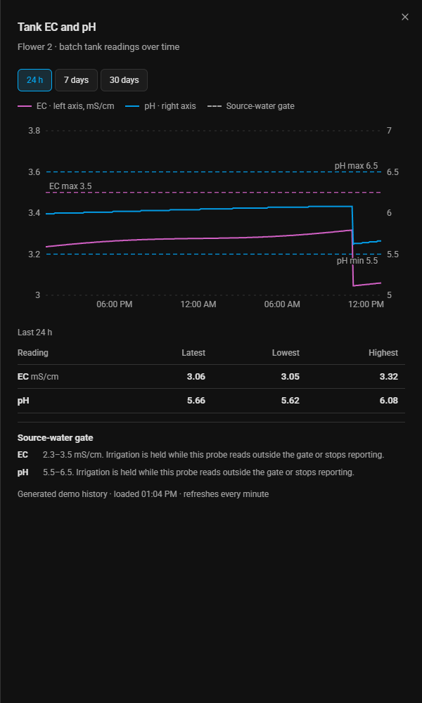
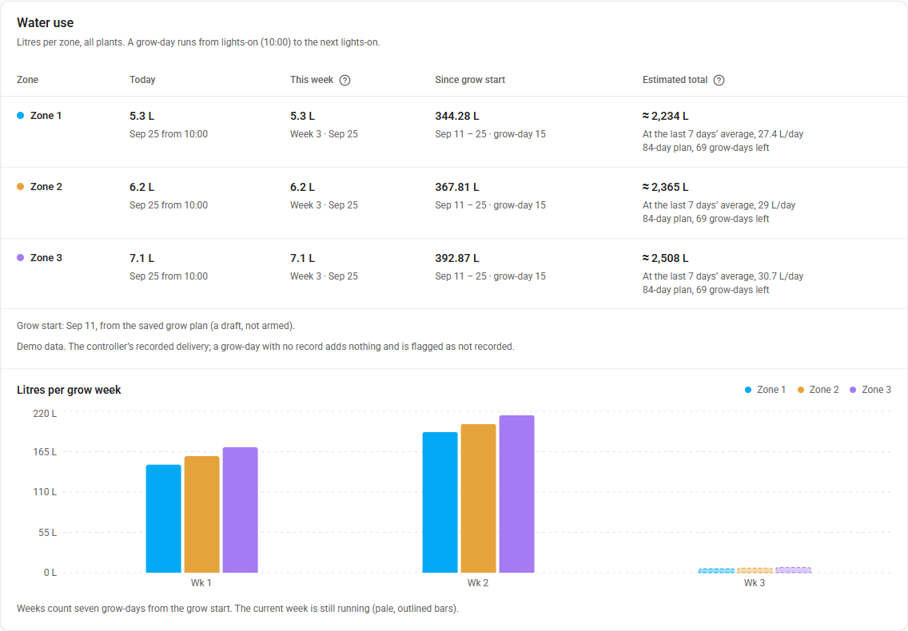
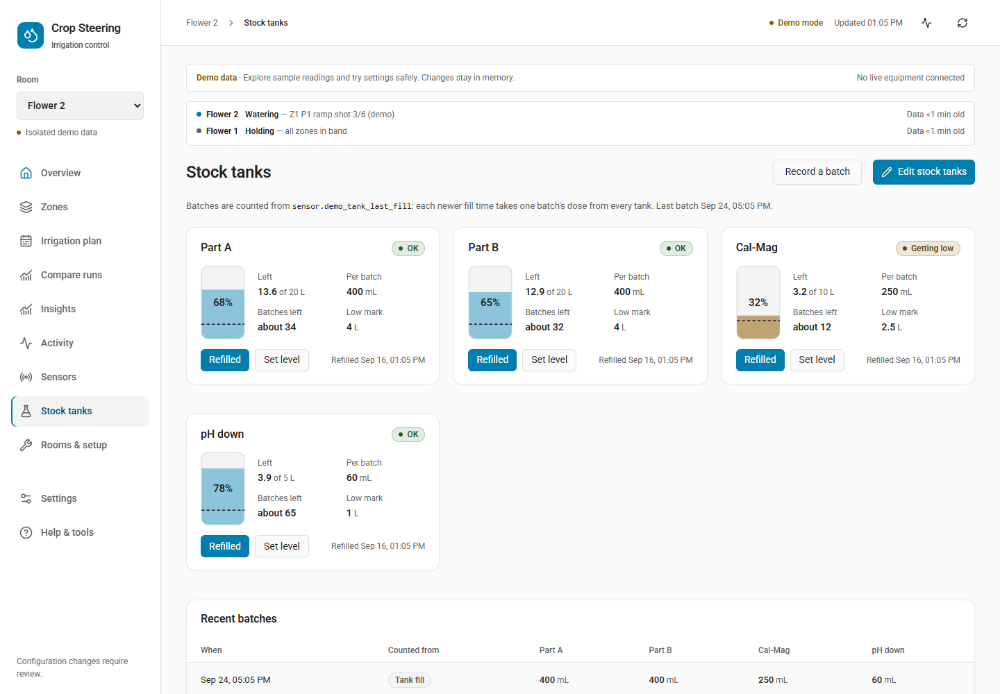

# Current workspace screenshots

[Open the interactive demo](https://jaketherabbit.github.io/HA-Irrigation-Strategy/dashboard.html?demo=1).

Captured on 25 September 2026 from the compiled application with isolated demo data and inherited Home Assistant dark-theme variables. These are current UI examples, not photographs or live facility readings.

## Overview

## Tank and pump

## Tank EC and pH history

## Water use per zone

## Stock tanks

## Irrigation plan: Schedule and combined VWC/EC curve

## Irrigation plan: Today, with the recorded zone and the projected day

## Recorded sensor history beside the setpoints

## Irrigation plan: Today beside the plan graph

## Room switched off

## Recorded run comparisons

## User-authored recipe library

## Rooms and sensor mapping

## Mobile overview

Reproduce these captures by building the frontend and running the browser checks in `frontend/scripts/` (`verify-workspace.mjs`, `verify-steering-visuals.mjs`, `verify-dashboard.mjs`, `verify-tank-status.mjs` and `verify-recipe-library.mjs`); each writes its screenshots into `img/`.
