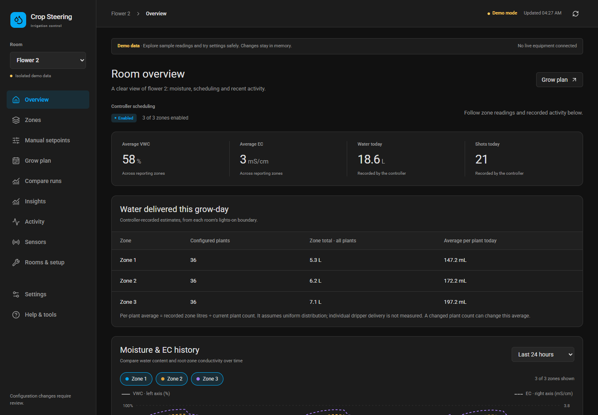
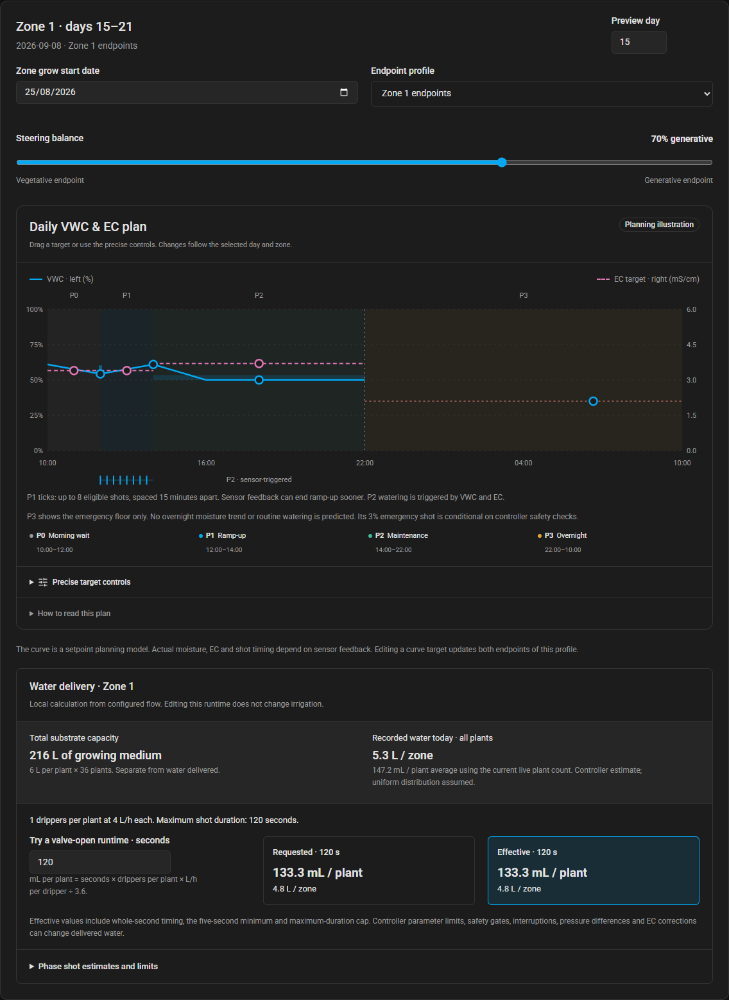
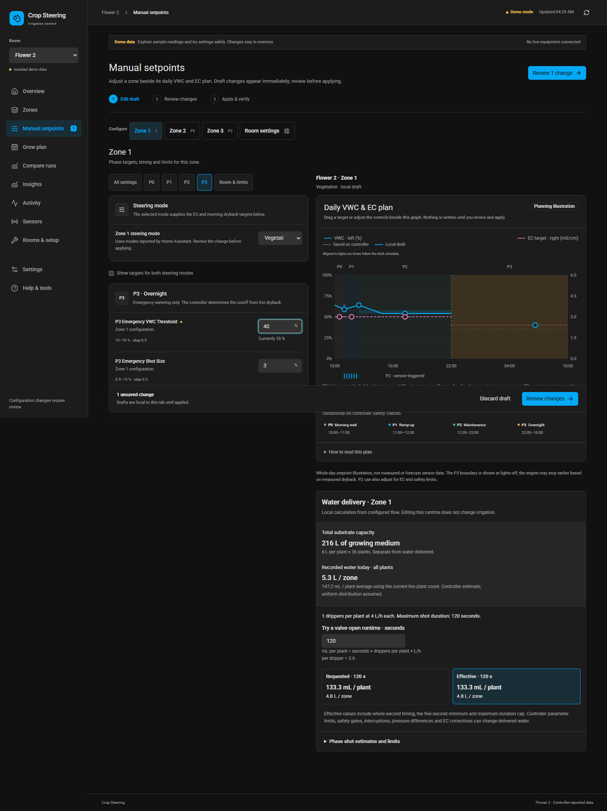
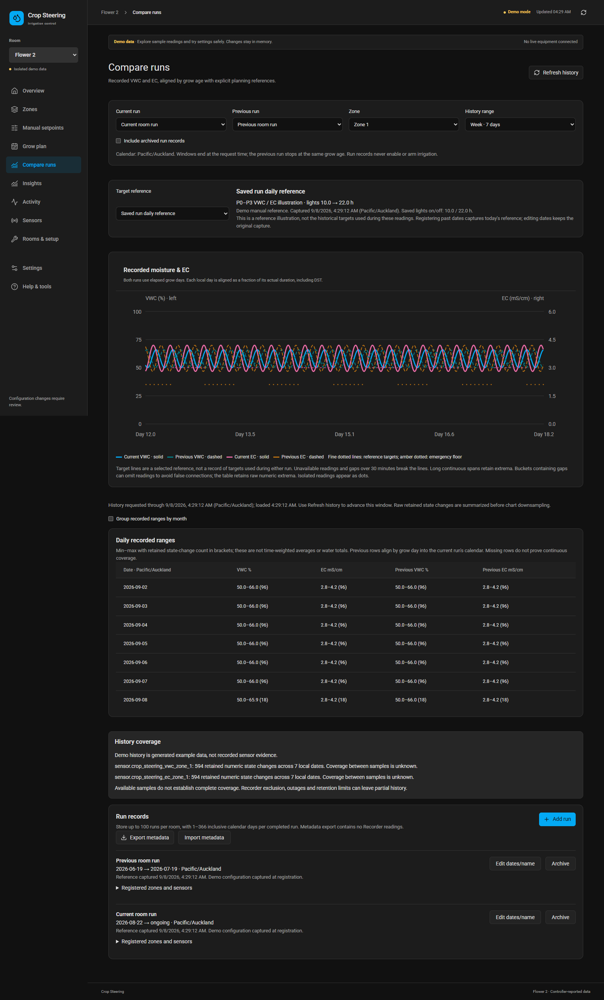
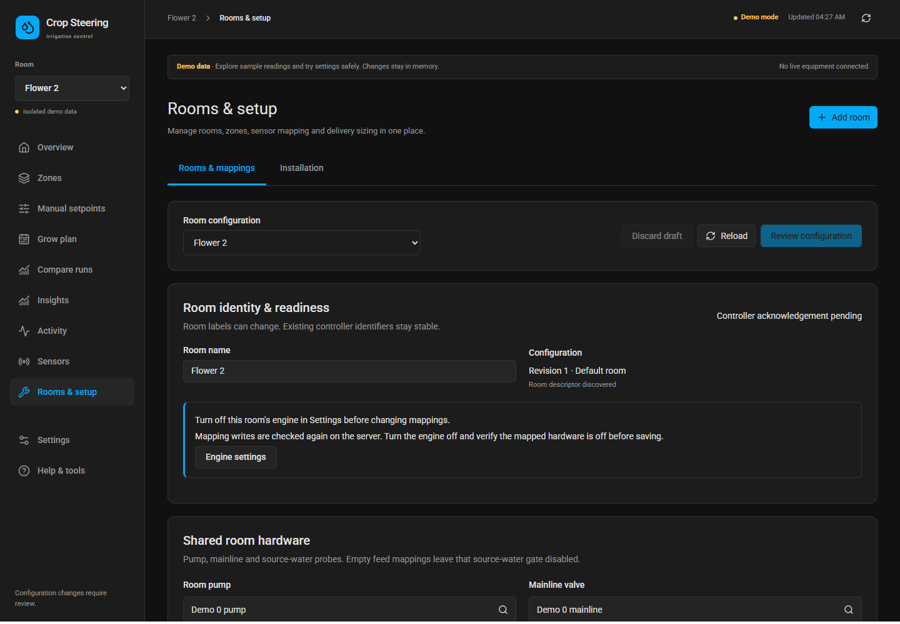
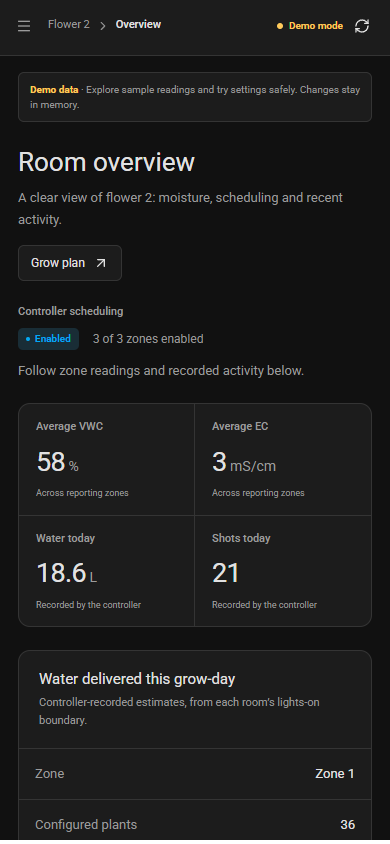

# Current workspace screenshots

[Open the interactive demo](https://jaketherabbit.github.io/HA-Irrigation-Strategy/dashboard.html?demo=1).

Captured on 8 September 2026 from the compiled application with isolated demo data and inherited Home Assistant dark-theme variables. These are current UI examples, not photographs or live facility readings.

## Room overview

## Combined VWC and EC planning curve

## Manual setpoints beside the planning curve

## Recorded run comparisons

## Rooms and sensor mapping

## Mobile overview

Reproduce these captures with `node frontend/scripts/verify-workspace.mjs` and `node frontend/scripts/verify-steering-visuals.mjs` after building the frontend. Historical screenshots live in archive/2026-09-08/img.
