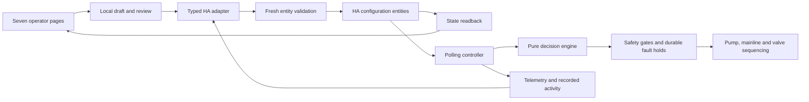

# Operator dashboard refactor: final verification

Date: 7 September 2026. Repository: HA-Irrigation-Strategy. Baseline: `972ae2be6307258c0a5a219ba1f0f414833beaac`, existing `feat/f2-two-room` branch. All changes are local and uncommitted. Nothing was published, deployed or sent to live Home Assistant.

## Outcome

The primary `www/f2.html` monolith has been replaced with a modular React/TypeScript dashboard using actual shadcn/ui and Radix components. Seven consistent task pages cover Overview, Zones, Irrigation strategy, Activity, Sensors, Settings and Help. The interface has responsive navigation, accessible dialogs, light/dark themes, readable charts, search/filter tools, and reviewed configuration changes with verified HA readback.

The original console is preserved at `www/f2-classic.html`. Specialist pages have shared return navigation and are separated from daily workflows. They retain their existing implementation and dependencies; this work does not claim that every specialist screen was rebuilt. Links to classic controls are available only for the default and F1 prefixes it actually supports.

The system audit also corrected three proven controller defects: elapsed watering time ignored HA request latency; blind fallback/copy could bypass its zone's daily water budget; and failed hardware shutdown did not prevent another shot using shared hardware. Failed closure now creates a durable hold that survives restart and temporarily absent room discovery, and requires explicit disarming plus verified hardware OFF before recovery.

## System and workflow

The new dashboard sends validated configuration writes, not direct hardware or unconsumed manual-shot events. A successful configuration result means HA state matched the requested value; it does not certify a physical irrigation result.

## Review findings resolved

| Finding | Final behavior |
| --- | --- |
| Duplicate default/named-F2 identity | Canonical prefix identities keep selection, history and writes separate. Explicit missing rooms remain unselected. |
| Old probes looked current | VWC/EC freshness defaults to 20 minutes; invalid, stale or excessively future timestamps become unavailable throughout the UI. |
| Unsupported specialist room silently became default | Actual prefix mapping gates specialist links and legacy redirects. Classic return links carry canonical identity. |
| Skip link changed the current page | Keyboard activation focuses the main landmark without changing the hash route. |
| Mobile overflow and hard-to-read zone tables | Mobile Overview uses stacked summaries; Zones defaults to cards; tested pages fit 390 px. |
| Partial or unconfirmed writes looked successful | Each write receives a fresh preflight and readback; failed draft entries remain available for correction/retry. |
| Shared-hardware hold disappeared with absent room descriptor | Saved room blocks remain independent of discovery; hold metadata, counters and unknown fields survive saves and returning discovery. |

The independent reviewer approved all corrected controller, adapter, UI and navigation findings with no unresolved findings from that review. Original reproductions and corrections remain in [the independent review](2026-09-07-independent-review.md).

## Verification results

| Check | Result |
| --- | --- |
| Integration, state migration and packaging Python suite | 88 passed |
| Real controller with fake HA and clocks | 36 passed |
| Pure decision engine suite | 46 passed |
| Frontend adapter and lifecycle Vitest suite | 25 passed across 3 files |
| TypeScript and production Vite build | Passed |
| Compiled desktop/mobile workflow groups | 14 passed |
| Mock-HA workflow groups | 10 passed |
| Automated axe WCAG A/AA checks | Zero violations in 12 captured states; additional mobile detail/review checks passed during implementation |
| Demo runtime network isolation | Zero external CDN or API requests |
| npm dependency audit | Zero reported vulnerabilities at verification time |
| Ruff, scoped Black and Prettier | Passed |
| YAML lint | Passed with 3 existing style warnings in config/install workflow files |
| Vendored decision engine | Both shipped source files byte-identical |
| Repository hygiene and git diff whitespace | Passed; no tracked caches or ignored shipped paths |
| Final HA/add-on HTML and shared navigation | Byte-identical packaged copies |

Totals: **195 unit/regression tests** and **24 browser workflow groups** passed. The 3 final packaging checks are included in the 88-test integration total, not additional tests.

The browser checks cover all seven pages at desktop and 390 px mobile, navigation history, keyboard skip, zone search/details, strategy validation/draft/review/apply, room-change draft protection, CSV export, persistent theme, unavailable probes, expired probes, 401/offline state, empty discovery, partial failure, mismatched readback, named F2 isolation, missing requested rooms, and classic default/F1 return routing. Browser traffic uses explicit demo fixtures or fully intercepted HA responses; no live installation is contacted.

The final full Python suites ran after the controller's discovery-retention correction. Subsequent frontend-only navigation/text changes were checked by the production build, all affected mock-HA workflows and packaging tests. Test scripts and CI configuration are included; see [TESTING.md](../../TESTING.md) for reproducible commands.

## Artifacts

- Primary standalone dashboard: `www/f2.html`.
- Matching add-on dashboard: `addons/f2_control/www/public/f2.html`.
- Source, pinned dependencies and packaging: `frontend/`.
- Operator/development guide: [OPERATOR_DASHBOARD.md](../OPERATOR_DASHBOARD.md).
- Controller/source analysis: [system audit](2026-09-07-system-audit.md).
- Adapter details: [adapter report](2026-09-07-adapter-report.md).
- UI details: [UI report](2026-09-07-ui-report.md).
- Browser evidence: `output/playwright/verification.json`, `live-verification.json` and page screenshots. These generated local evidence files are gitignored; CI uploads them as an artifact.
- Screenshot used in README: `img/operator-dashboard.png`.

The local preview is [Open dashboard demo](http://127.0.0.1:5198/f2.html?demo). It is served by a loopback-only Python process in this workspace. A later session can restart it with `python -m http.server 5198 --bind 127.0.0.1 --directory www`.

## Practical limits and retained findings

- Live HA session inheritance, real Recorder/API behavior, actual hardware operation and add-on runtime deployment have not been exercised. Docker image build, GitHub-only hassfest/HACS checks and remote CI execution were not run locally. No release version was changed.
- Legacy manual-shot/phase/timeout services emit events without a consumer in this shipped polling controller. Existing recipe services can target every room and stage application can partially fail. These remain backend/legacy limitations documented in the audit; the new UI does not offer them as verified actions.
- An engine flag or configuration readback is not proof of physical watering. Zone/system/auto disable stops eligibility for future shots; the controller's engine kill/manual override controls are the existing active-shot interruption path.
- Timing and volumes remain software estimates; device/network delays can exceed nominal request deadlines. Ordinary blind budgets retain the existing start-of-shot cap rule, so a shot started below the cap can cross it.
- Historical charts depend on HA Recorder. Time-only activity records retain their reported time and do not invent dates. Unavailable data never becomes zero or demo data.
- Canonical room URLs avoid the ambiguity of old F2 aliases. Classic specialists intentionally remain unavailable for unsupported named rooms.

The pre-existing untracked `www/aigrow-ops.html` and `addons/f2_control/www/public/aigrow-ops.html` were excluded from writes and packaging. No credentials are embedded in generated assets.

Final primary HTML: 818257 bytes; SHA-256 `32fdd1797e4f54efbe4fd9c364cb5ed04610fcc1a645ee9fa8b0e750ebb027df`.
